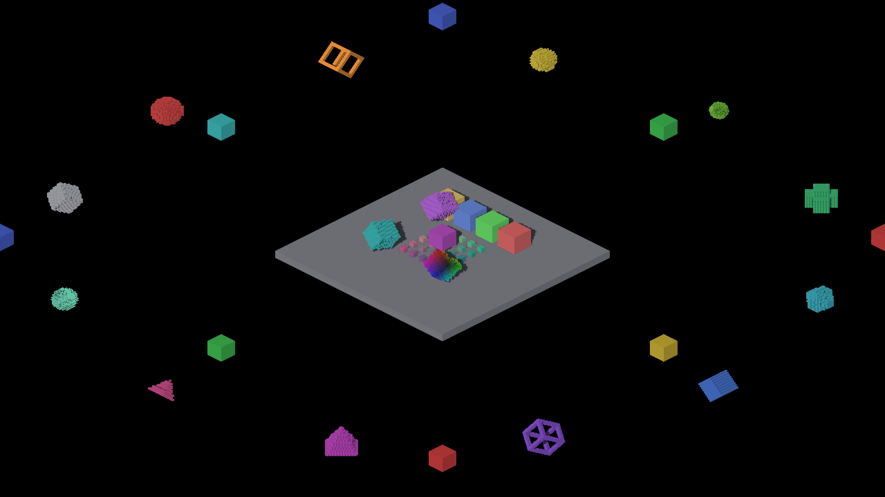
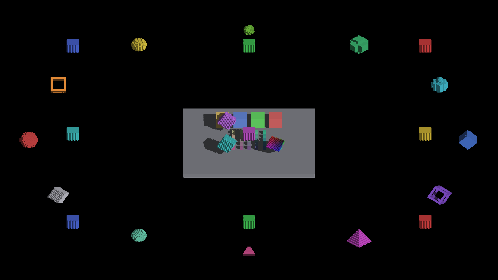

# Timestamp-ring cleanup: unchanged pixels

Native macOS Metal captures of IRCanvasStress. Baseline: master
`e1e5b98a34395bb3c6078b9fd6edeedbefb100e7`. Candidate: that base plus this
PR's timestamp-ring cleanup, built while the changes were uncommitted.
[captures.json](captures.json) records commands, executable hashes and PNG hashes.

Each run completed with `ir-run: RESULT=CLEAN`. At yaw 0 and 45 degrees:

- Baseline timing-on and candidate timing-on PNGs are byte-identical.
- Candidate timing-on and timing-off PNGs are byte-identical.
- Decoded RGB differences also contain zero changed pixels.

| Yaw | Baseline, timers on | Candidate, timers on | Candidate, timers off |
|---|---|---|---|
| 0° |  |  |  |
| 45° |  |  |  |

Reproduce after `fleet-build --target IRCanvasStress`:

```sh
fleet-run IRCanvasStress --auto-screenshot 10 --no-spin --no-auto-rotate --pivot-origin --zoom 1 --subdivisions 1 --sweep-yaw 0 0.7853981633974483 2 --auto-profile
```

Omit `--auto-profile` for the timers-off control. In this demo that flag enables
frame and GPU stage timing. Both profiled runs emitted whole-system and per-axis
substage samples; these short captures are correctness checks, not performance
measurements.

The images retain the baseline scene's rough/striped silhouettes and face
patterns. This evidence demonstrates unchanged output for these two poses,
not that all existing visual artifacts are correct or that other backends have
been validated.
