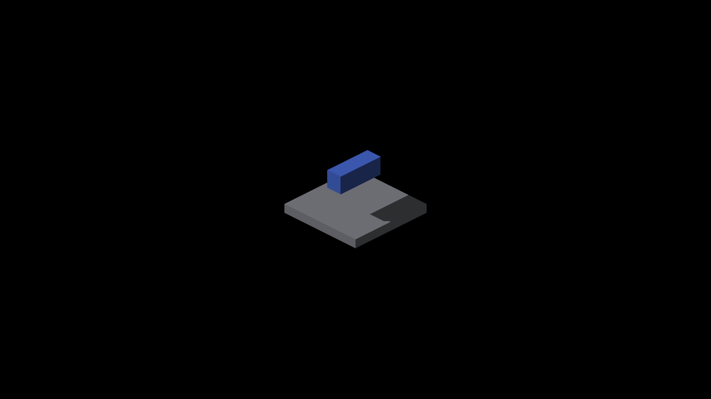

# Revoxelized cardinal shadow geometry

The previous box oracle predicted a half-cell displacement that the renderer
already cancels. This slice corrects that geometric expectation and adds a
private-canvas size control for actual density coverage. It changes no engine
shadow, lighting, bias, filtering or edge tolerance.

For a lattice center `p = n + a`, integer `n`, anchor `a`, and positive integer
density `d`, the producer snaps the center and carries the phase separately:

```
raster = roundHalfUp(p*d)/d
phase = a - roundHalfUp(a*d)/d
raster + phase = n + a = p
```

`SYSTEM_VOXEL_TO_TRIXEL_STAGE_1` stores that phase in `renderedCellOffset_`;
`bakeVoxelFaces` rotates it into the world origin. Presentation carries the same
phase. At cardinal yaw this fixture's half-integer lattice is invariant under
quarter turns, so inverse resampling preserves its occupied cells. The old
metric rounded rotated centers without the phase. GRID has no private-canvas
phase correction and retains its separate snapping expectation.

The independent test enumerates the authored 864 centers, reconstructs inverse
occupancy with explicit quarter-turn coordinate permutations, and projects all
occupied cube corners onto the receiver. It compares convex hull support planes
at four yaws and densities 1–4. It does not reuse the metric's corner snapping or
rotation helper. Restoring the old metric expression makes this test fail;
existing literal tooth, hole, shifted edge and missing-shadow controls still
fail as designed. The one-pixel Chebyshev edge tolerance is unchanged.

## Native evidence

Metal / Apple M4 Max, 2560×1440, fixed origin pivot, zoom 2, no spin or AO.
Receiver is the continuous source-face floor. All retained runs exited CLEAN.

| Actual private caster density | Canvas edge | Captures, yaw 0/90/180/270 | Strict edge result |
|---|---|---|---|
| 1 | 128 | 2173–2176 | 4/4, zero missing/excess pixels |
| 2 | 288 | 2181–2184 | 4/4, zero missing/excess pixels |
| 3 | 384 | 2185–2188 | 4/4, zero missing/excess pixels |

The source-floor canvas remains at density one. The logs show the caster's
actual density alternating with that floor density; requested subdivisions are
not the measured density. An initial `--subdivisions 3` run at canvas edge 128
remained capped at one (2177–2180, not retained as extra density evidence).
`--probe-box-canvas-size` now controls only the private shadowbox canvas, clamped
to 128–1024, default 128. Its world geometry and pool dimensions are unchanged.

The corrected oracle still rejects all four older pre-index captures 2168–2171:
missing/excess counts 1/1, 2/7, 13/15, 6/24. Those images are retained in the
[parent evidence](../finite-voxel-shadow-query/README.md). This establishes that
the finite-face query improvement survives the corrected geometric test. Fresh
captures 2173–2176 use that indexed path with off-map record culling. All images
are unfiltered; the visible test mask remains image-derived and its area can
vary with caster display coverage.



The scope is this cardinal box's projected shadow boundary onto a source-face
receiver. It does not establish arbitrary rotated occupancy, caster display
silhouette correctness, SDF/GRID receiver edges, self-shadowing or dense index
overflow quality. Those remain separate work. No new performance claim.

## Reproduction

```sh
fleet-build --target IRCanvasStress -j 3
fleet-run --timeout 60 IRCanvasStress --only shadowbox,floor --probe-floor-mode source --probe-box-canvas-size 384 --pivot-origin --no-spin --no-auto-rotate --no-ao --subdivisions 3 --zoom 2 --auto-screenshot 6 --sweep-yaw 0 4.71238898 4
python3 scripts/render-shadow-box-metric.py --effective-subdivisions 3 --iso-scale 8 4 --strict-edges docs/pr-screenshots/codex/revoxelized-shadow-oracle/capture-2185.png docs/pr-screenshots/codex/revoxelized-shadow-oracle/capture-2186.png docs/pr-screenshots/codex/revoxelized-shadow-oracle/capture-2187.png docs/pr-screenshots/codex/revoxelized-shadow-oracle/capture-2188.png
python3 scripts/tests/test_render_shadow_box_edges.py
```

Use canvas edge 288 for density 2. Density 1 captures use the default 128 canvas
and requested subdivisions 1. All 34 render test suites pass, as do native build,
header-checks, format-changed and ruff. Independent focused review confirms the
cardinal phase identity and the old-expression mutation failure. Native OpenGL
execution remains pending.
