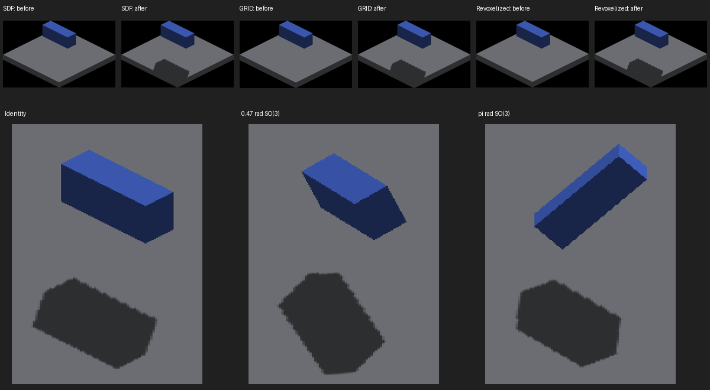

# Rigid source-face shadow casters

Plain world-placed `DETACHED` objects now cast their original, continuously
transformed voxel faces through the finite-face sun baker. Revoxelized objects
continue casting their resampled occupancy. Both reuse the same exposed-face
selection, finite parallelogram rasterization and shadow buffers.

The source transform cancels camera rotation before entering world/light space.
Source voxel centers are not snapped to the revoxelization lattice. Arbitrarily
rotated caster faces use generic finite-surface metadata rather than a false
world-axis normal. That metadata does not retain the actual caster normal;
receiver-plane reconstruction remains an approximation at contact and boundaries.
Owner visibility and screen locking exclude detached casters from world shadows.
This changes the finite-face pipeline, not the legacy texture-depth fallback.

Top: matching source casters on SDF, GRID and revoxelized receivers, before
(left) and after (right). Bottom: identity, 0.47 and pi radians about the
(1,1,1) axis. Full captures are retained; the contact sheet is resized for review.
The parent comparison frames are 1552, 1568 and 1584 in the
[mode matrix](../shadow-receiver-mode-matrix/README.md).

## Validation

Native Metal, Apple M4 Max. `runs.json` retains exact commands; compressed logs
retain all 19 clean four-frame runs (76 full screenshots, 1702–1777).

- Identity, 0.47 and pi source rotations pass all 12 aggregate projected-hull
  checks. All 12 strict edge checks still fail at their unchanged tolerance.
  `metrics.json` retains commands, output and nonzero strict-check exit codes.
  Macro silhouette support is improved; clean projected edges are not established.
- Source casting is visible on SDF, GRID and revoxelized receivers. Plain source
  receivers still do not receive world shadows. Four diagonal revoxelized-receiver
  views are retained as additional visual coverage, not an exact geometry pass.
- Hidden source and hidden revoxelized casters each match the empty floor in all
  four views. Existing GRID/SDF and revoxelized/revoxelized mode controls each
  match their parent frames byte-for-byte in RGB (16 comparisons total).
  `regressions.json` records differing-pixel counts, all zero.
- Source/SDF contact controls at offsets Z=10 and Z=12 differ by 688–1,216 pixels
  on their common gray receiver masks. `contact-comparison.json` and matched crops
  retain this boundary discrepancy. They are not certified equivalent at contact.
- Screen-locked source controls retain no world shadow. The final visible-source
  run reproduces the original identity capture after the visibility guard.
- IRCanvasStress and header-checks builds pass (591 headers, 34 Metal kernels).
  Rendering unit tests pass (173); scalar shader helper tests cover both backends.
  No OpenGL runtime or large-population performance claim is made.

The diagonal-pose hull oracle uses authored box corners and independent Rodrigues
rotation, with a literal 120-degree axis-permutation test. It does not read the
renderer shadow map. Effective density remains one and the supplied projection
scale is 8 by 4 screenshot pixels; calibration is not inferred from SDF bounds.

## Remaining work

Resolve finite shadow boundaries and receiver contact using geometric controls,
then implement source-face reception. Keep participation and receiver sampling
(local trixel versus continuous surface) distinct from placement and overlays.
No receiver sampling option is introduced here. Wider temporal, density, light
angle and backend coverage remains necessary before claiming complete parity.

The default scene already includes rigid `DETACHED` frame, octahedron and sphere
orbits on several axes. The dedicated `--only rigid` group from the preceding
[SO(3) probes](../rigid-voxel-rotation-probes/README.md) remains available; no
duplicate default-scene objects are needed.
