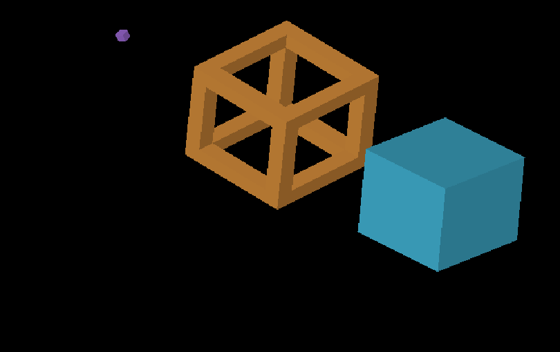
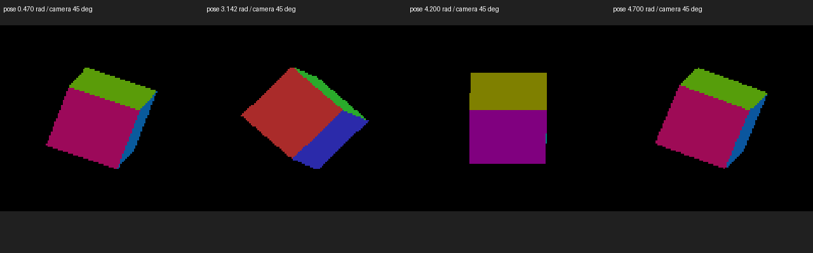

# Rigid voxel rotation probes

`IRCanvasStress --only rigid` demonstrates full SO(3) object rotation using
`RotationMode::DETACHED` and continuous source faces. The source voxel occupancy
is unchanged: there is no GRID rebake or detached revoxelization. The capability
already exists in the engine; this adds an identifiable solid cube (X axis),
hollow frame (Y axis), and single-voxel normal probe ((1,1,1) axis).



The GIF is a nearest-neighbor reduced crop of eight fixed-camera captures,
120 update frames apart. It illustrates rotation, not continuous temporal or
all-pose certification. Full captures and compressed run logs are retained.
Native Metal on Apple M4 Max; parent 5ed65d2a9 plus this probe change.
All five retained runs exited CLEAN. Runtime renderer/shaders are unchanged.

## Run interactively

```sh
fleet-run IRCanvasStress --only rigid --no-auto-rotate --pivot-origin --no-ao --no-shadows --zoom 3
```

`--focus-rigid 0|1|2` centers a single probe. `--frozen-pose RADIANS` fixes its
angle about its own axis, and `--sweep-yaw` varies the camera independently.
Without a frozen pose the probes spin; `--no-spin` retains the initial 45-degree
pose. The default scene is unchanged; select the named group to view it.

## Independent geometry and normal checks

Sixteen magnified single-voxel captures combine object angles 0.47, pi, 4.2 and
4.7 radians about (1,1,1) with camera yaws 0,45,90,135 degrees. The source-face
oracle projects original face corners with Rodrigues rotation; it does not use
renderer trixel parity or register images to a reference. World normals are
rotated with the source geometry, independently of screen triangle parity.

Fourteen checks pass with zero missing, extra or wrong-normal pixels beyond the
existing one-screenshot-pixel allowance. Two 4.2-radian cases have an almost
edge-on face with no testable interior: they remain **inconclusive**, not passes.
All sixteen report zero counted mismatches; `metrics.json` preserves the exact
results and commands. The 4.7-radian controls provide adequately sized faces at
those camera angles. No thresholds were relaxed.



Example half-turn control:

```sh
fleet-run IRCanvasStress --only rigid --focus-rigid 2 --frozen-pose 3.141592653589793 --no-auto-rotate --pivot-origin --no-ao --no-shadows --debug-overlay normals --zoom 16 --auto-screenshot 6 --sweep-yaw 0 2.35619449 4
python3 scripts/render-source-face-metric.py docs/pr-screenshots/codex/rigid-voxel-rotation-probes/screenshot_001683.png --shape voxel --axis-angle 1 1 1 180 --yaw 45 --iso-scale 64 32 --normals
```

The oracle now accepts an explicit axis-angle. Literal quarter-turn basis-vector
controls catch sign/ignored-rotation errors; tiny/large axis scales and norm
preservation cover normalization. Existing literal face, spike, missing interior
and swapped-normal controls remain. All 172 rendering tests pass.

## Remaining work

Plain source-face DETACHED still lacks world-shadow casting/receiving, as the
[caster/receiver matrix](../shadow-receiver-mode-matrix/README.md) demonstrates.
That support gap must be addressed without silently switching to revoxelization.
This evidence checks one-voxel silhouette/normals; the multi-voxel animation is
visual coverage, not a numerical depth/occlusion proof for arbitrary concavity.
OpenGL execution, dense temporal transition checks, placement variants, shadow
participation and population-scale performance remain unverified here.
