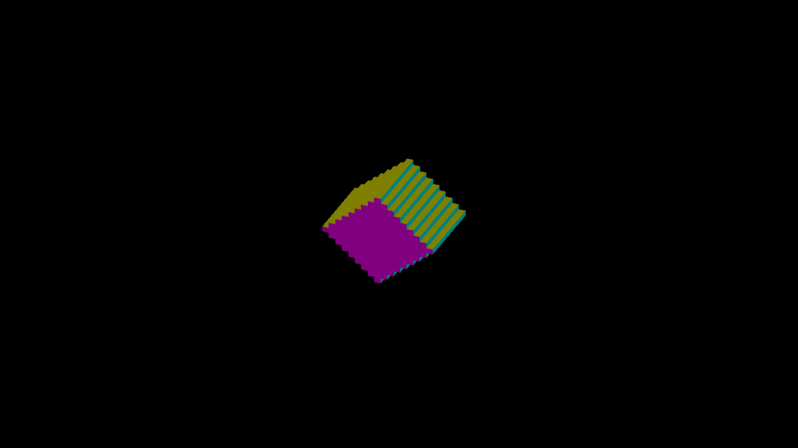

# Remaining finite-face boundary control

This is diagnostic evidence, not a renderer fix. The current engine still
misses game pixel `(605,454)` at actual yaw `0.38781238`, frozen orbit entity 6,
zoom 4, 1280×720 game output. Its signed -Y face belongs to cell `(1,-5,8)`.
The independent projection places one corner at game Y `453.4004132696`, about
0.000023 pixels above an eight-bit subpixel rounding threshold. The strict
raster diagnostic continues to fail this frame; no tolerance has been added.

The [earlier independent draw](../scatter-centered-projection/README.md)
projected vertices on the CPU in double precision. `gpu-world-reference.mm`
instead sends unprojected world positions and float32 yaw to a native Metal
vertex shader. That shader performs its own float32 rotation and projection,
without engine storage, face recovery, depth ties or compositing. All 33 fine
sweep images agree with the CPU-projected native reference; the engine still
differs at the same single pixel. `comparison.json` records both comparisons.
The input remains [the same independent occupancy and captured angles](../scatter-centered-projection/fine/reference/input.json).
Compile/run conventions are the same as the earlier native reference.

| Engine: known missing pixel | Independent GPU world projection |
|---|---|
|  |  |

`engine.png` is the unchanged retained full 2560×1440 capture; the reference is
the direct 1280×720 render target. Compare every 2×2 engine output block against
one reference pixel, without filtering.

Two Metal-only experiments were rejected and restored before profiling:

- Move canvas-size division from each projected coordinate to the corresponding
  matrix column before multiplying. This does not change the 33 captured images.
- Round recovered `baseOrigin` to an integer before applying its encoded
  sixteenth-cell fraction. This also does not change the images. It was a
  discriminating control, not a proposed general rounding policy.

`experiments.json` retains commands and binary/shader hashes. Both accepted
capture runs exited cleanly; an earlier sandboxed launch and an invalid-overlay
launch are excluded. The next discriminating control is a standalone draw using
captured engine matrix/uniform values and exact vertex inputs, to separate
transform rounding from face emission. The evidence does not establish which
one causes the remaining miss. Native OpenGL remains unverified.
