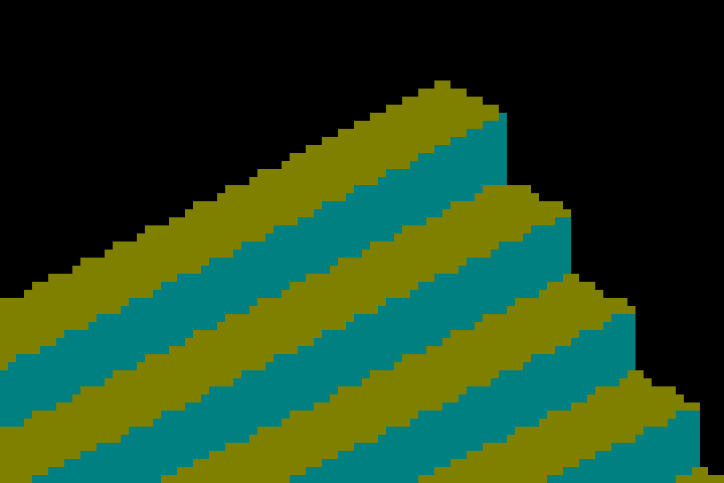
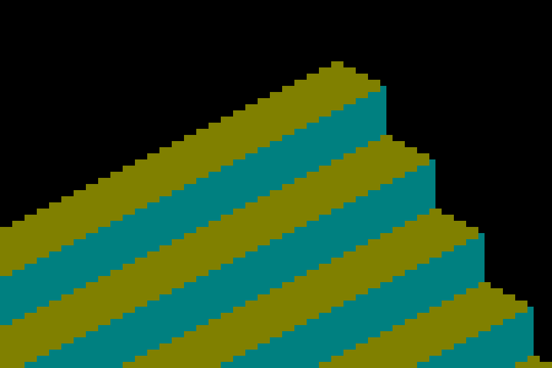

# Cardinal gather boundary ownership

The frozen orbit-6 GRID cube exposed missing pixels, extra pixels and wrong-face
colors at cardinal views. Normalized UV interpolation followed by texel rescaling
rounded exact sampling boundaries into neighboring cells. Carrying centered texel
coordinates between the vertex and fragment stages fixes this without changing
the lattice, face selection, filtering or shadow softness.

## Before and after

| Before | After |
|---|---|
|  |  |

These are nearest-neighbor enlargements of output rectangle `(1250,500)` to
`(1430,620)` in `shot-0.png`, with no smoothing. The full images and all other
camera views are retained in `before/` and `after/`. The staircase bands themselves
are valid exposed faces of the inverse-resampled occupied cells.

## Independent geometry check

`cardinal-geometry.json` contains the strict ray-oracle results. Each view checks
84,000 game samples, or 336,000 output pixels at the captured 2× output scale,
including empty silhouette space. The integer traversal uses exact face crossings;
there is no boundary tolerance or reference-image allowance.

| Camera yaw | Incorrect output pixels before | After |
|---|---:|---:|
| 0° | 752 | 0 |
| 90° | 688 | 0 |
| 180° | 676 | 0 |
| 270° | 732 | 0 |
| Total | 2,848 | 0 |

The 17-frame sweep samples 0–360° at 22.5° intervals. `sweep-diff.json` shows
that only cardinal views change, including the repeated endpoint; all twelve
intermediate views remain RGB-identical. The original finite-face yaw135° gate
also remains exact. This does not close the remaining intermediate-angle
ideal-ray diagnostic differences (15 wrong-face and four missing game samples).
`ideal-ray-diagnostic.json` retains that diagnostic from the first centered-texel
experiment; all 17 of its images are RGB-identical to the final capture. Unlike
the cardinal integer oracle, that diagnostic uses floating-point ideal angles
and is not an acceptance gate for hardware boundary ownership.

## Reproduction and provenance

Both arms use parent `c8e6969f662d2ae05c041ff327d4337a954f3620`; the after arm
stages the shader changes in this commit. `source-provenance.json` hashes those
three source files. Each capture manifest records the binary and staged shader
hashes, command and clean-exit result; `source_dirty` lists shader changes only.
Compressed logs retain actual capture poses and clean shutdown. Both runs use
native macOS Metal, 1280×720 game resolution and 2560×1440 output.

```sh
fleet-build -j2 --target IRCanvasStress
fleet-run --timeout 120 IRCanvasStress --auto-screenshot 6 --only orbit --focus-orbit 6 --no-spin --no-auto-rotate --pivot-origin --no-ao --debug-overlay normals --zoom 4 --subdivisions 2 --sweep-yaw 0 6.28318530718 17
python3 scripts/render-orbit-geometry-metric.py docs/pr-screenshots/codex/scatter-boundary-ownership/after/shot-0.png --yaw 0
```

The four cardinal manifest shots enforce zero mismatches on native render runs.
Oracle unit tests also deliberately corrupt individual silhouette and face pixels
and require each corruption to fail.

Validation on the final shaders:

- CanvasStress: 18/18 checks pass; all eight existing RGB comparisons are 100%,
  with maximum channel delta zero. No reference images or thresholds changed.
- ShapeDebug GUI: 33/33 assertions pass, including hover/parity identity.
- Render tooling: `bash scripts/tests/run_all.sh` passes all 61 isolated suites,
  including five orbit-oracle tests and the shader uniform/receiver contracts.
- Header conventions, changed-source formatting, Ruff, comment-reference and
  instruction-size checks pass.

OpenGL sources mirror the mapping, but native Windows/OpenGL presentation remains
pending. No performance gain is claimed from this small arithmetic change.
