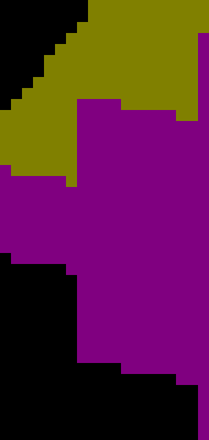

# Centered finite-face projection

Per-axis scatter centers the storage anchor before adding a projected world
corner, preserving fractional bits at shared raster edges. GL and Metal use the
same algebraic rewrite; depth, lighting, fragment work and face geometry are
unchanged. No dilation, epsilon, blur or additional render pass is introduced.

## Independent expectation

`native-reference.mm` draws the exposed faces of independently constructed orbit
occupancy directly through Metal. Its vertex shader only copies CPU-generated
clip positions and signed-face colors; it uses a regular depth buffer. It has no
engine/trixel storage, decode, overflow, composition or depth-tie code.
Inputs and native reference images are under `coarse/reference` and
`fine/reference`. The source is a retained diagnostic for these trusted inputs,
not a general-purpose engine tool. It exits nonzero on input/device/pipeline/draw
or output failures.

The Python [raster metric](../../../../scripts/render-orbit-raster-metric.py)
independently quantizes vertices to an explicit 8-bit subpixel lattice and uses
integer top-left coverage. The shared-edge rule has one owner, not a tolerance
region. All 50 native reference frames match the Python model exactly. This validates
the model on this Metal host;
OpenGL needs independent validation before making this its default gate.

The original continuous-ray diagnostic counted 19 differing game samples before
and 11 after, including two apparently new differences at 22.5°. That initially
caused rejection of this projection rewrite. The independent native draw
reproduces those two differences too. Ideal ray and hardware raster coverage
must therefore remain separate expectations at subpixel boundaries.

## Results

| Control | Before incorrect game samples | After |
|---|---:|---:|
| 17 views, full yaw sweep | 12 | 0 |
| 33 views, yaw 0.38–0.405 radians | 46 | 1 |

Every game pixel expands to four identical output pixels in these captures.
`gpu-comparison.json` in each sweep reports both game and output counts, complete
error coordinates, actual yaw and signed-face colors. All full before/after and
native reference PNGs are retained. No newly incorrect sample appears in the
fine sweep. Its one remaining miss, game coordinate (605,454), yaw 0.38781238,
is present in both revisions. The strict diagnostic still fails that frame;
this is a bounded improvement, not universal edge correctness.

The 8× nearest-neighbor details below show fine frame 26, where the previous
projection loses part of a one-pixel-wide visible side face. Full frame paths
remain available for context.

| Before | After |
|---|---|
|  |  |

The coarse baseline is the existing cardinal-gather capture; its shader sources
match the parent of this change. The fine baseline and candidate were captured
sequentially on `09b3d080bf6d7d81422345911884285148795096`. Manifests record source
revision, binary/shader hashes, commands and clean exits. `candidate.patch` and
`provenance.json` identify the dirty shader candidate. An earlier overlapping
capture contaminated a render-suite file enumeration; it is excluded. The clean
sequential rerun passes all 18 existing render checks, with unchanged references
and thresholds.

## Reproduction

Capture arguments are in the before/after manifests. The fixture is frozen
orbit 6, origin pivot, normals overlay, zoom 4, requested subdivisions 2.
Use actual `CaptureCamera` yaw, not the requested sweep angle:

```bash
python3 scripts/render-orbit-raster-metric.py docs/pr-screenshots/codex/scatter-centered-projection/coarse/after/shot-5.png --yaw-radians 1.9634955 --subpixel-bits 8
python3 scripts/tests/test_render_orbit_raster_metric.py
```

The first command requires zero mismatched output pixels. The test suite also
rejects a single missing, extra or wrongly colored output pixel, including the
second pixel in an upscaled game block.

To reproduce the independent native draw on macOS, compile the retained source
with `clang++ -std=c++17 -fobjc-arc native-reference.mm -framework Foundation
-framework Metal -o /tmp/orbit-native-reference`, create an empty output directory,
and pass `reference/input.json` and that directory as its two arguments. Each
`shot-N.rgba` is a 1280×720, top-to-bottom RGBA8 image. Convert without filtering
(e.g. Pillow `Image.frombytes("RGBA", (1280,720), bytes).save(path)`).
The native reference does not use or update engine screenshot references.

## Validation limits

- Native Metal, 1280×720 game output, 2560×1440 captures, this fixed occupancy.
- Existing cardinal integer-ray and yaw-135 analytical gates remain unchanged.
- Eight-bit raster precision is not assumed portable to other hardware.
- The remaining fine-sweep miss stays on the worklist; no mismatch threshold.
- No FPS gain or large-population performance result is claimed for this rewrite.
