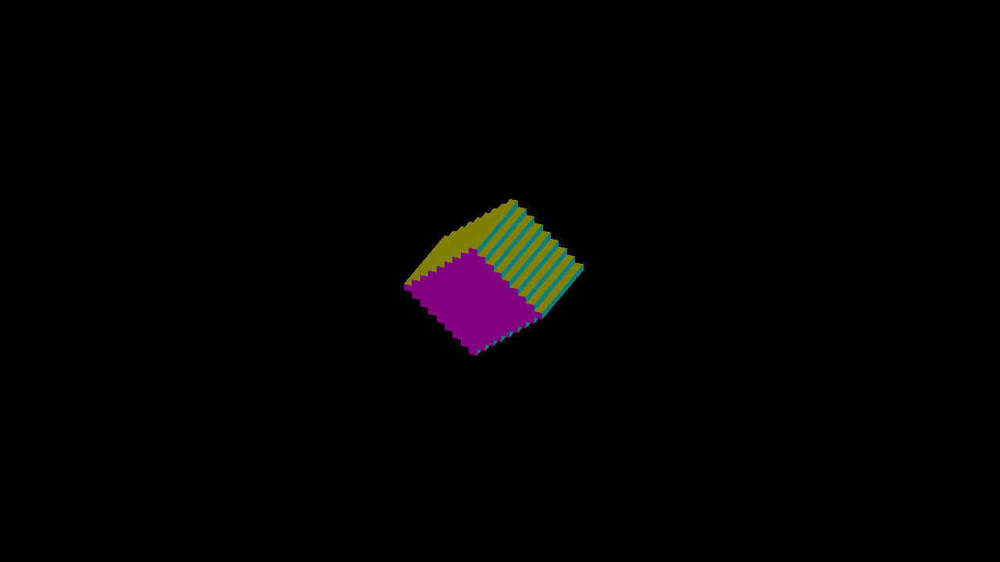

# Finite-face projection replay

The remaining single-pixel discrepancy is a reference setup mismatch in this
Metal fixture. Independent exposed cube faces match all 33 current engine
captures when rasterized into the same padded, Y-reflected intermediate target.
No production renderer change, edge expansion, smoothing, tolerance, reference
refresh, or rounding adjustment is needed for this result.

| Native reference setup | Former projection: differing game pixels | Centered projection: differing game pixels |
|---|---:|---:|
| Captured float32 matrix, padded/reflected target | 45 | **0** |
| Direct world projection, padded/reflected target | 45 | **0** |
| Direct world projection, unpadded/reflected target | 46 | 1 |
| Direct world projection, padded/unreflected target | 46 | 1 |

Counts sum all 33 views; full per-view results are in `comparison.json`.
Both padding and reflection matter to this boundary sample. These controls do
not isolate a portable hardware rounding rule. The former projection is the
positive control: it still fails the correctly matched reference at 45 pixels.
The strict ideal/direct-target metric remains unchanged and still reports its
one-sample disagreement; it does not model the actual intermediate target.

| Engine capture, unchanged | Independent matched-target draw, presented |
|---|---|
|  |  |

The engine PNG is the retained 2560×1440 capture. The reference PNG is its
1280×720 game-resolution counterpart. It comes from a Y reflection followed by
the exact center crop `(2,1,1282,721)` of the raw 1284×722 target, with no filter.
`verify.py` checks that **every** engine 2×2 block is uniform before comparing
all game pixels; it excludes no boundary pixels.

## Captured inputs and independent geometry

Engine commit: `04dbbd747ffe0df7bdb6749e5adc420fb2ab2319`, macOS/Metal Debug.
Frozen CanvasStress orbit entity 6, inverse-resampled 12³ occupancy rotated
45° about Y, origin pivot, zoom 4, subdivisions 2, no AO/spin, normals overlay.
The capture command is retained in `raw.tar.gz: capture/manifest.json`; it sweeps
33 yaw poses from 0.38 to 0.405 radians. Actual float32 poses are in `input.json`.

Temporary `capture-inputs.patch` logs the actual matrices, dimensions and encoded
face while `IR_SCATTER_CAPTURE_INPUTS=1`. The instrumented run exited cleanly;
all 33 full output images are identical to the retained centered-projection
captures. The patch was restored and the demo rebuilt before publication. The
capture manifest's `source_dirty` field covers shaders only; it must not be read
as proof that the instrumented C++ tree was clean. `replay-manifest.json` records
that distinction and the independent program/source hashes.

At disputed game pixel `(605,454)`, actual yaw `0.387812376`:

- Per-axis canvas: 1284×1364; main canvas: 642×722; framebuffer: 1284×722.
- Canvas base `(641,681)`, camera iso `(0,0)`.
- The -Y face at canvas texel `(635,701)` contains encoded value `148001`:
  raw depth 4, slot 1, three fraction codes 8, flip 0. It reconstructs cell
  `(1,-5,8)`, so the face exists in the regular storage lane.
- `captured-inputs.json` retains all matrix columns and inputs for each pose.

Each native reference independently enumerates exposed unit cube faces from
`input.json` occupancy, with 1,106 triangles per view. It uses float32 GPU world
rotation, a separate continuous depth value, and flat signed-normal colors.
It does not use engine trixel encoding, face recovery, overflow, ties or lighting.
The captured-matrix draw uses the engine's transform values; the direct variant
uses `clip = (8*iso.x/642, 4*iso.y/361)` and reaches the same result without them.
Thus the matrix's small translation residual is not needed to explain this
fixture's coverage. The final presentation reflection is consistent with
`framebuffer_to_screen.metal::v_framebuffer_to_screen` and nearest framebuffer sampling.

## Reproduce and inspect

Run the retained, zero-tolerance comparison from the repository root (Pillow
required):

```bash
python3 docs/pr-screenshots/codex/scatter-projection-replay/verify.py
```

`raw.tar.gz` contains all 132 unmodified RGBA8 targets, four exact standalone
ObjC++ programs, and the capture log/manifest. It deliberately retains each
experimental source unchanged. Extract into a temporary directory; for each
variant compile its `reference.mm` using `clang++ -std=c++17 -fobjc-arc`, link
`-framework Foundation -framework Metal`, and run through
`engine/tools/bin/ir-acquire gpu -- <binary> <input.json> <existing-output-dir>`.
The exact compile/run arguments and hashes are in `replay-manifest.json`.
The programs emit `shot-0.rgba` through `shot-32.rgba`; dimensions and presentation
transforms are explicit in `verify.py`. The independently generated occupancy
is the same as the earlier [centered-projection fixture](../scatter-centered-projection/README.md).

This closes the disputed Metal sample for this fixture, not every rendering
mode or shadow path. Native OpenGL presentation validation, translated cameras
and other framebuffer sizes remain separate coverage. No performance gain is
claimed; the next measured bottleneck is high-density cardinal dispatch work.
