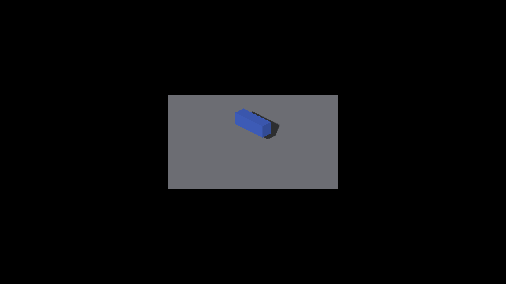

# Finite analytical box shadow receivers

Before: parent `1b82d92db810d67456dbc2ad18b82d135a7069ec`.
After: this directory's committing tree. Native macOS, Apple M4 Max, Metal,
2560×1440 framebuffer. Images are unmodified full-frame captures.

```sh
fleet-run --timeout 60 IRCanvasStress --only shadowbox,floor --probe-analytic-box --pivot-origin --no-spin --no-auto-rotate --no-ao --subdivisions 3 --zoom 2.5 --auto-screenshot 6 --sweep-yaw 0 0.78539816 2
```

| Pose | Before | After |
|---|---|---|
| 0° |  |  |
| 45° |  |  |

Before captures: 2239/2240. Final after captures: 2245/2246. The earlier after
run, 2241/2242, is pixel-identical to the final repeat. The changed RGB pixels
are 908 at 0° and 1468 at 45°, localized to receiver shadow comparisons.
Geometry and placement remain stable. Shadow outlines remain jagged: one factor
per trixel is still insufficient for the final fragment boundary. These images
are evidence of the bounded receiver integration, not acceptance of sharp edges.
No blur or tolerance adjustment was added.

The ownership control used the existing recipe with `--probe-sdf-depth-tie`,
`--no-shadows`, subdivisions 1, zoom 4 and 120 warmup frames. After captures
2243/2244 match parent-stack controls 2235/2236 exactly in RGB. All runs exited
CLEAN. The finite query/selection/layout tests separately guard mathematical
geometry and fallback behavior. Native OpenGL and GPU timing remain pending.

Additional native lifetime smoke used `--probe-analytic-sphere
--probe-analytic-canvases 3` with the same freeze/density settings and
`--sweep-yaw 0 4.71238898 4` (captures 2247–2250). It exited CLEAN.
Sphere surface speckles remain visible and unaccepted; this run does not claim
curved-surface correctness or final shadow-outline acceptance.
