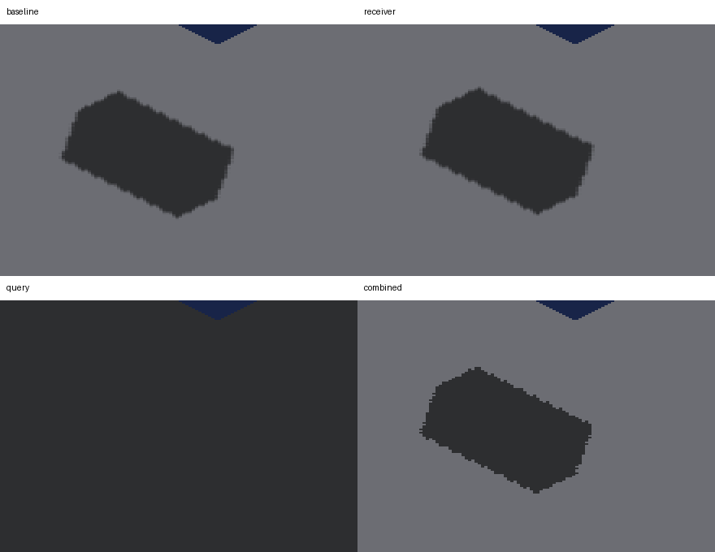

# SDF floor receiver and shadow-query controls

Diagnostic captures against `8e0cac16737d09bb0815761ca0b7a14b80403a64`
(PR #3635), on native Metal / Apple M4 Max. That experimental base is
intentionally outside this PR's refreshed ancestry: the cascade correction
is deferred for its floor regression. Reproduce on the explicitly pinned SHA,
not this documentation PR's current head. No production shader changes
are included. All four arms fail the strict floor-edge gate at all four yaws.



Panels: baseline, receiver-only, query-only, combined. Each is an unscaled
440 × 310 crop from `(1060, 680)` in its full capture, with a 30-pixel label
header. The blackened query-only floor is a failure, not missing evidence.
Full 2560 × 1440 captures are retained for every arm and yaw.

## Controlled factors

- **Baseline:** the stack's existing receiver recovery and raster shadow query.
- **Receiver:** move the reconstructed sample to the known floor plane `z=2`,
  correcting the rectangular sample center and projecting along the yawed view
  ray; supply its known `(0,0,-1)` normal in the engine convention.
- **Query:** select the existing `worldSurfaceSunShadowFactor` for non-per-axis
  receivers instead of `worldSunShadowFactor`. This changes a grouped query
  contract, including raster normal-offset/filter behavior; it does not isolate
  bias from filtering.
- **Combined:** both changes together.

The patches deliberately affect **every non-per-axis sample**, not just the
floor. They are fixture-only interventions. The oracle assesses the visible
neutral floor; cube or border shading in these captures is not correctness
evidence for those surfaces. No general SDF receiver implementation can use
this hardcoded plane or normal.

## Results

Counts are missing/excess pixels outside the unchanged one-screenshot-pixel
Chebyshev boundary band. Density and projection are supplied explicitly.

| Yaw | Baseline | Receiver | Query | Combined |
|---|---:|---:|---:|---:|
| 0° | 207 / 141 | 231 / 208 | 0 / 872205 | 18 / 28 |
| 90° | 65 / 515 | 276 / 584 | 0 / 859130 | 22 / 43 |
| 180° | 19 / 356 | 241 / 881 | 0 / 860827 | 48 / 96 |
| 270° | 96 / 546 | 216 / 787 | 0 / 862769 | 29 / 44 |

Receiver-only worsens both counts in every view. Query-only shadows almost
the entire floor, consistent with a receiver-plane/self-shadow mismatch;
that attribution is an inference, not a traced caster-identity result.
Combined reduces the total error in every view, but at 180° its missing
pixels rise from 19 to 48. It is not an unqualified improvement or a passing
fix. Full results, including the strict verdicts, are in `*-metrics.txt`.

The result supports treating receiver geometry and the query contract together.
It does not establish that either change alone is sufficient. The residual
also does not distinguish finite sun-map coverage from one-value-per-trixel
presentation. The separate [exact-ray controls](../floor-shadow-plane-sampling/README.md)
show why final presentation remains part of the problem.

## Reproduction

Use an isolated checkout of the base SHA. Apply exactly one of `receiver.patch`,
`query.patch`, or `combined.patch` to that clean checkout; baseline applies none.
The patches are alternatives, not successive commits. Rebuild assets after each
change and after restoring the shader:

```sh
fleet-build --target IRCanvasStressAssets -j 3
fleet-run --timeout 45 IRCanvasStress --only shadowbox,floor --probe-grid --pivot-origin --no-spin --no-auto-rotate --no-ao --subdivisions 1 --zoom 2 --auto-screenshot 6 --sweep-yaw 0 4.71238898 4
```

The scene uses one GRID caster and the SDF floor, zoom 2, effective caster
density 2, and a 1280 × 720 framebuffer presented at 2560 × 1440.
For each arm, pass its four PNG paths in yaw order 0, 90, 180, 270:

```sh
python3 scripts/render-shadow-box-metric.py --grid --effective-subdivisions 2 --iso-scale 8 4 --strict-edges <yaw0.png> <yaw90.png> <yaw180.png> <yaw270.png>
```

Each invocation exits 1, as expected for the retained rendering failures.
Screenshot sequences: baseline 2023–2026, receiver 2027–2030,
query 2031–2034, combined 2035–2038. `*-run.txt` contains the retained
capture/exit log excerpts (not complete logs). The initial sandbox launch had
no display connection and produced no captures; `failed-sandbox-launch.log`
records that failed attempt. The subsequent native runs exited CLEAN.
The shader was restored and assets rebuilt after the last arm.

## Next implementation contract

Recover the surface selected by the winning producer, with coherent position,
normal, owner and coverage. Preserve the chosen representation: an analytical
SDF surface and a voxelized SDF cell are not interchangeable. Query and present
shadows on that same surface, including finite projected boundaries. Avoid
per-fragment entity scans and population-sized metadata when visible winners
can carry the necessary information. Acceptance still requires all quadrants,
mixed caster/receiver modes and the existing strict edge tests without looser
tolerances, footprint inflation, blur or compensating bias.
