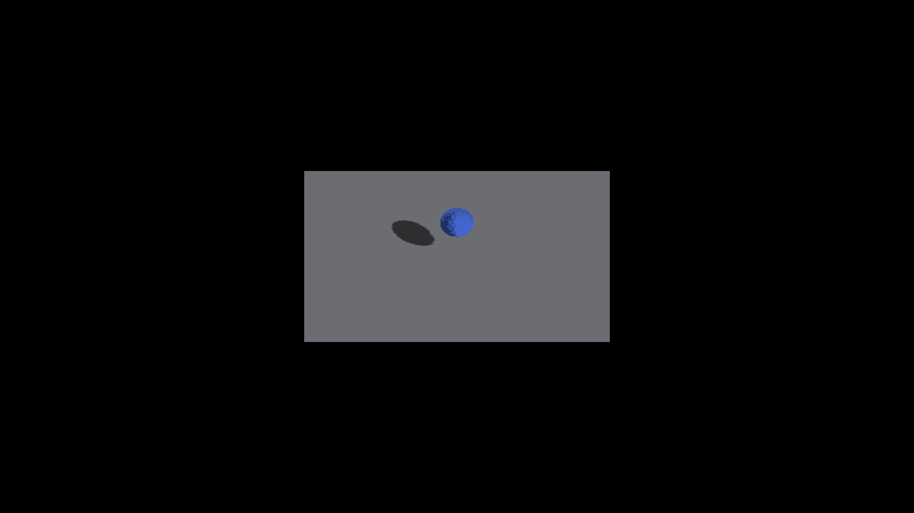

# Retained SDF election evidence

Native Apple M4 Max / Metal, 2560×1440, 2026-09-22. This change retains the
existing owner-election and tile buffers per shape canvas. It adds no shader
pass and is expected to preserve the pictures, including existing artifacts.

Before images are the after-controls from [descriptor storage](../sdf-receiver-provenance/README.md), captured at `fc93aceaf` (the renderer code at
parent `4a4000824`; its later scheduler-only alignment has no pixel effect).
After images are captured with this directory’s implementation commit.
Both recipes from that capture record were repeated unchanged. Runs exited
CLEAN. Full-frame RGB comparison gives zero differing pixels for all four pairs,
without masking, filtering or tolerance changes. Sphere speckles remain.

| Fixture | Before | After |
|---|---|---|
| Three analytic canvases, yaw 0 |  |  |
| Three analytic canvases, yaw 45 |  |  |
| Coincident boxes, shadows off, yaw 0 |  |  |
| Coincident boxes, shadows off, yaw 45 |  |  |

After capture numbers: 2233, 2234, 2235, 2236 respectively. These images verify
preservation; lifecycle and mutation tests exercise the production resource
owner through an in-memory backend adapter. They do not read back and certify
every GPU election key. No throughput improvement or final shadow-edge fix is
claimed. OpenGL runtime smoke remains pending.

The retained keys describe the SDF pass winner only. Later overpainting still
requires explicit validity handling before a fragment or lighting consumer can
use them. See [receiver design](../../../design/sdf-receiver-geometry.md) for the
encoding and memory cost.
