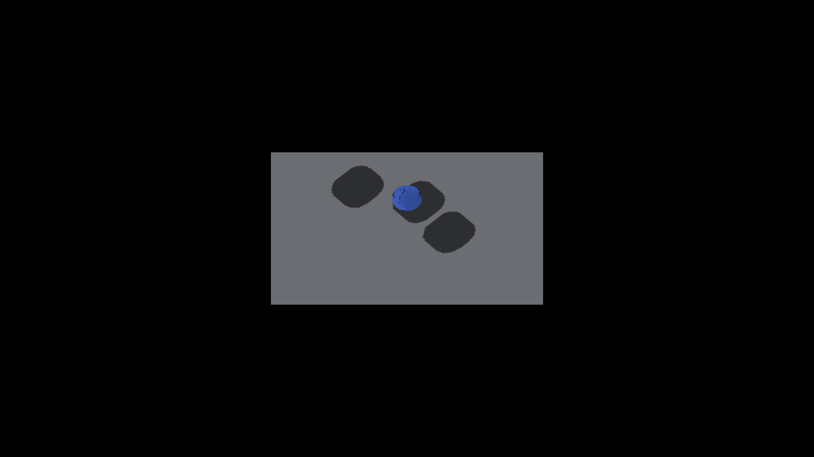

# SDF sample validity controls

Apple M4 Max / Metal, 2560×1440, 2026-09-22. Before: captures 2233/2234
from parent `09026b7d0`. After: 2237/2238 from this implementation. The
[prior capture recipe](../sdf-sample-provenance/README.md) was repeated unchanged
for three analytic canvases at yaw 0°/45°. The run exited CLEAN. Both full-frame
RGB comparisons have zero differing pixels, without masks or tolerance changes.

| Yaw | Before | After |
|---|---|---|
| 0° |  |  |
| 45° |  |  |

The images are preservation controls. Existing sphere speckles remain, and no
shadow-edge improvement is claimed. The new validity state is not yet consumed
by presentation. Lifecycle tests execute publication, invalidation and X-ray
rejection through the production resource owner; writer call-site coverage is
source-pinned, not GPU readback of every producer.

`python3 scripts/gui-verify.py --no-build IRShapeDebug -- --gui-test` passes all
33 assertions after declaring foreign GUI canvas writes in scheduler metadata.
`IRShapeDebug` and `IRUIWidgetsDemo` build successfully. The widget demo’s
three-shot `--auto-screenshot 10` run exits CLEAN. Windows/OpenGL runtime
smoke remains pending.
