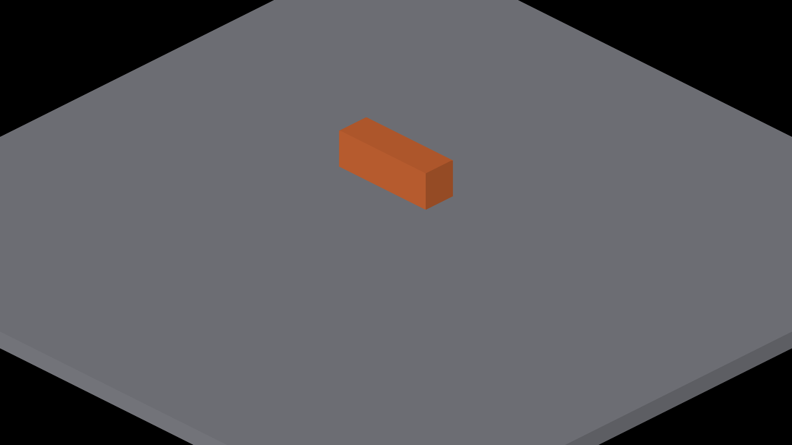
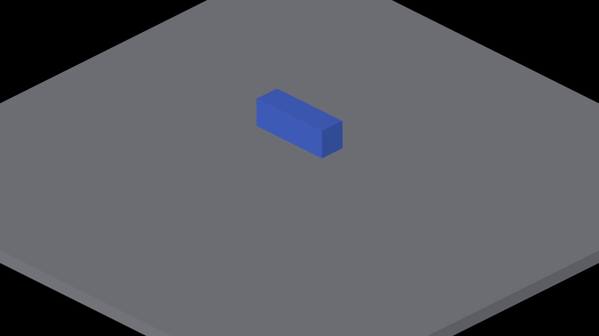

# Deterministic opaque SDF ownership

Native Metal captures on Apple M4 Max, 2560×1440. Parent production code:
`479964b7a67d572b47ce22ab575101bcbf540930`, with the new overlap fixture added.
The fixture submits coincident blue and orange analytic boxes. Blue is first
in the fixed submission order and must own every winning opaque sample.

## Results

| Capture group | Configuration | Observation |
|---|---|---|
| 2079–2082 | Ownership enabled; yaw 0/90/180/270° | Blue wins throughout; zero orange pixels in the color segmentation |
| 2083–2086 | Negative control: remove only the Metal publication owner predicate | Orange wins almost everywhere, with stray blue pixels at two angles |
| 2087–2091 | Ownership enabled; three analytic canvases, subdivision 3; yaw 0/22.5/45/67.5/90° | Clean exit; displayed main box remains blue. Smoke coverage, not an oracle for every auxiliary surface |
| 2092–2093 | Actual parent production implementation; yaw 0/45° | Baseline for the paired profile recipe |
| 2096–2097 | Ownership implementation; same recipe | Deterministic blue winner |

The negative control is a deliberate mutation, not the untouched parent.
Opaque color/identity publication has one writer for a fixed tile submission
order. Reordering descriptors can change the tie winner. X-ray blending is
outside this guarantee. This change does not yet retain receiver geometry or
fix projected shadow edges.

Parent:



Ownership enabled:



## Reproduce

Build with `fleet-build --target IRCanvasStress -j 3`.

```sh
fleet-run --timeout 45 IRCanvasStress --only shadowbox --probe-analytic-box --probe-sdf-depth-tie --pivot-origin --no-spin --no-auto-rotate --no-shadows --no-ao --subdivisions 1 --zoom 4 --auto-screenshot 6 --sweep-yaw 0 4.71238898 4
fleet-run --timeout 45 IRCanvasStress --only shadowbox --probe-analytic-box --probe-sdf-depth-tie --probe-analytic-canvases 3 --pivot-origin --no-spin --no-auto-rotate --no-ao --subdivisions 3 --zoom 2.5 --auto-screenshot 6 --sweep-yaw 0 1.57079633 5
fleet-run --timeout 60 IRCanvasStress --only shadowbox,floor --probe-analytic-box --probe-sdf-depth-tie --pivot-origin --no-spin --no-auto-rotate --no-shadows --no-ao --subdivisions 1 --zoom 4 --auto-profile --auto-screenshot 120 --sweep-yaw 0 0.78539816 2
```

Do not add `--no-lighting`: the current demo pipeline then omits shape
rasterization. An initial attempt with that flag was black and rejected.

## Measured cost — merge consideration

The last recipe ran twice per implementation, 245 frames per run, with 244
valid GPU shape-stage samples in each report. Raw reports are adjacent.

| Implementation/run | CPU ShapesToTrixel average ms | GPU shapePass1 average ms |
|---|---:|---:|
| Parent 1 | 0.083 | 0.942 |
| Parent 2 | 0.084 | 1.040 |
| Ownership 1 | 0.092 | 1.982 |
| Ownership 2 | 0.092 | 1.965 |
| Compile-specialized ownership 1 | 0.840¹ | 1.669 |
| Compile-specialized ownership 2 | 0.094 | 1.518 |

Compile-time depth, owner, publish, and caster variants recover 15–23% of the
pre-specialization ownership cost by removing the runtime pass branch and
dead pass-specific work from each kernel. The remaining 46–77% increase over
the parent is the extra owner-election surface solve itself, so this remains a
measured tradeoff rather than a performance-neutral fix. `shapePass1` measures
the entire shape-system bundle, including encoder-boundary effects, not the
election kernel alone. The reports include startup/transition outliers and
rejected timestamp pairs; these are aggregate timings, not a per-pose benchmark
or a population scaling claim. The runs were sequential on the same host.

¹ The first specialized run's CPU average includes one 183.574 ms outlier;
its minimum was 0.058 ms and the repeat averaged 0.094 ms.

Storage is four bytes per pixel of the largest processed SDF canvas, reused
across canvases and frames. Only canvases with SDF tiles pay the added clear
and election dispatch. The kernels are compile-time specializations of one
shared body, so depth and owner passes no longer carry publish-only color,
checker, identity, or X-ray work. Avoiding the remaining repeated SDF
evaluation would require a separate tie-gated dispatch design.

## Validation

- Native target build, format-changed and header-checks passed.
- Rendering test runner: 31 suites passed, zero failures.
- New winner tests: three passed; extracted GLSL/Metal scalar logic rejects
  aliased owners, missing owner checks and missing depth checks. Capacity
  overflow also fails the production static assertion.
- Independent review found a buffer-clear synchronization requirement;
  an ALL barrier before the clear addresses it. Re-review found no remaining
  correctness blockers.
- Native OpenGL execution remains unverified; scalar shader tests do not
  replace Windows smoke validation.

## Merge-readiness specialization check

After merging current master, the publish-only color/checker/depth-color, fog
identity and X-ray setup is explicitly guarded by `IR_SHAPE_PASS == 1` in both
backends. A preprocessing test checks all four variants and deliberately
removes the guard to prove the excluded work returns. Compiler dead-code
elimination may already remove this arithmetic; explicit gating does not
establish a speedup.

The same paired recipe above was rerun on the merged tree, changing only the
publish guard in runtime shader assets for the control. Gated captures
2213/2214 and ungated captures 2215/2216 are RGB-identical at yaw 0/45°, with
the blue owner retained. Both runs exited cleanly after 245 frames. Raw reports:
[publish gated](publish-gated-profile.txt) and [ungated](publish-ungated-profile.txt).
The gated GPU `shapePass1` mean is 1.144 ms; the control is 2.327 ms.
These single pairs include startup/transition outliers and do not isolate
election cost. They do not supersede the original ownership-versus-no-election
cost comparison or claim performance neutrality.

The merged root passes all 31 rendering suites (four ownership tests), native
IRCanvasStress build and header checks. Native OpenGL remains pending.
