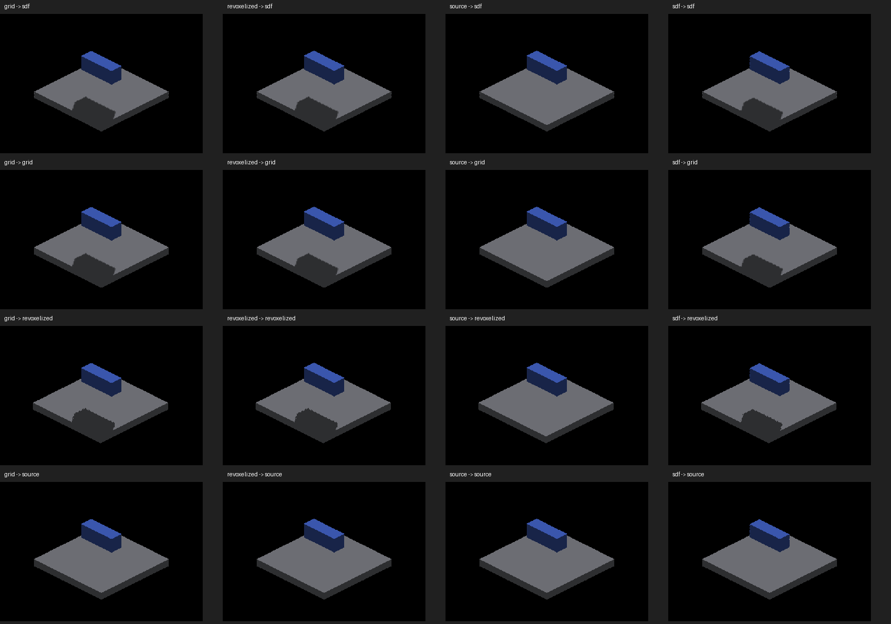
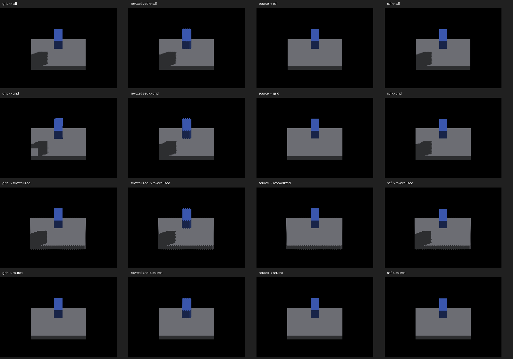

# Caster/receiver mode matrix

Native Metal, Apple M4 Max; parent e143e8c51 plus this demo change.
128 full screenshots: four caster modes × four receiver modes × eight camera
yaws (0 through 315 degrees in 45-degree steps). Every retained run exited CLEAN.
`runs.json` records exact commands and screenshot membership; matching compressed
logs preserve effective subdivision reports. Contact sheets use nearest-neighbor
reduced crops; full frames are authoritative for pixel inspection.

The compact receiver is 40×40×4 centered at (0,0,4); the caster is 18×6×8
centered at (0,0,-12). Camera pivot is fixed, zoom 2, requested subdivisions 1,
no object spin, no AO. Effective density varies by canvas; consult the logs.
Some shadows reach the finite receiver boundary. These are diagnostic captures,
not strict polygon acceptance, temporal stability, or performance evidence.




## Findings

- GRID, revoxelized detached and SDF casters produce shadows on those same three
  receiver types. Jagged boundaries remain; intermediate GRID views also reveal
  interior missing shadow patches, which need isolated receiver reconstruction checks.
- Plain DETACHED source-face casters produce no world shadow in this fixture;
  plain source-face receivers show no received world shadow. This is an existing
  support gap, not an intentional projection quality option.
- Revoxelized geometry has its own staircase silhouette at intermediate angles.
  A differing triangle or edge is not automatically an occlusion defect.
- The first attempt revoxelized the default 120-wide floor and hit the existing
  shared buffer capacity assertion before capture. The bounded compact fixture
  avoids that unsupported allocation. No failed-run screenshots are retained.

## Controls

`--probe-floor-mode sdf|grid|revoxelized|source` selects the receiver.
SDF retains the default 120-wide floor; other modes default to width 32.
`--probe-floor-span 40` gives matched dimensions (nonzero values clamp to 8..40).
`--probe-source-box` selects the continuous source-face caster; existing GRID and
analytic selectors take precedence. Without caster selectors, shadowbox uses
revoxelized detached geometry. The private floor canvas is 512×512: arbitrary
zoom/subdivision combinations are not certified by this matrix.

Example (other exact combinations are in runs.json):

```sh
fleet-run IRCanvasStress --only shadowbox,floor --probe-grid --probe-floor-mode revoxelized --probe-floor-span 40 --pivot-origin --no-spin --no-auto-rotate --no-ao --subdivisions 1 --zoom 2 --auto-screenshot 6 --sweep-yaw 0.785398163 5.497787144 4
```

## Proposed sampling choices

Keep world placement, caster participation, receiver participation and receiver
sampling density distinct. A local-voxel/trixel receiver mode is useful: evaluate
world occlusion at reconstructed local face samples and retain that sampling in
the object's canvas. A continuous-surface mode would evaluate geometric coverage
on the displayed face, retaining crisp boundaries rather than blurring. Both
must transform positions and oriented normals into the same world/light space;
local sampling does not mean a separate local light or shadow direction.

These are proposed options, not newly implemented engine API. First establish
correctness of existing sampling, then implement surface coverage and explicit
participation controls. Preserve screen-locked overlays as a separate contract;
this matrix uses world-placed objects and does not certify overlay behavior.
