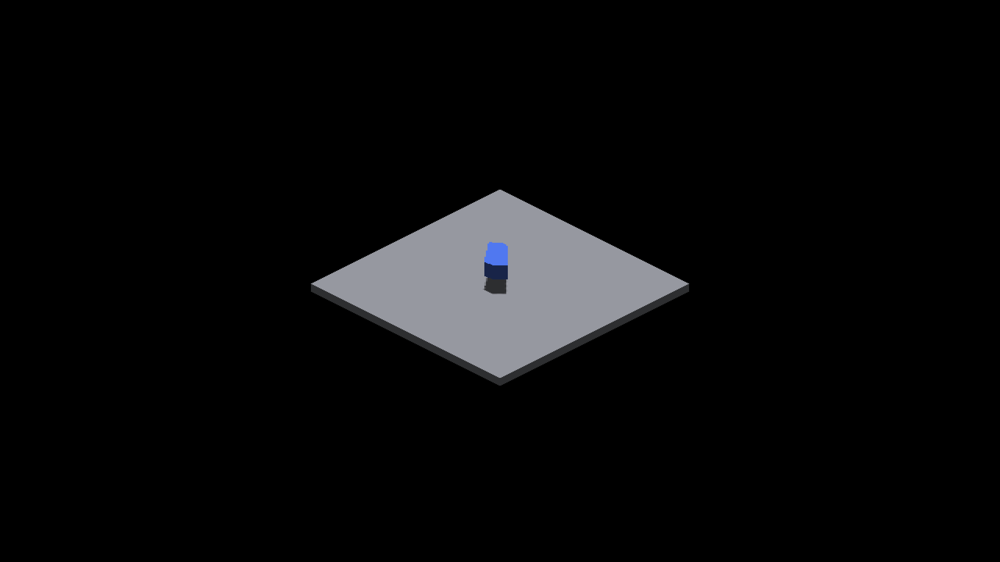

# Deferred tile carry stepping

Apple M4 Max, macOS 26.5.2, Metal Debug, battery power, 2560×1440.
`IRCanvasStress`, camera yaw 0, origin pivot, zoom 1, subdivision 1,
spin and automatic rotation disabled. Both arms use the same binary at
`2183e854875dfa003f35fc03d30f198d1cf624bb`; candidate stages the carry iterator.
These are `round-1/screenshots/capture-1.png` from the named profiling cases.
All 32 full-matrix paired captures are RGB-identical.

The span-512 control has one analytical box plus the floor under the demo's
default sun. Its large blue face fills the viewport, so this pair witnesses
the indexing workload rather than detailed shadow quality.

| Span 512 baseline | Span 512 candidate |
|---|---|
|  |  |

The oblique control has 128 overlapping analytical boxes plus the floor and
an overhead sun `(0, 0, -1)`. The initial box yaw is 0.785398163 radians;
successive boxes move 0.03125 units along X and rotate 0.001 radians.

| Oblique 128 baseline | Oblique 128 candidate |
|---|---|
|  |  |

[Commands, measurements, patch and rejection decision](../../../perf/shadow-tile-stride.md).
The iterator remains deferred; these unchanged images do not establish a
performance improvement or fix pre-existing shadow artifacts.
