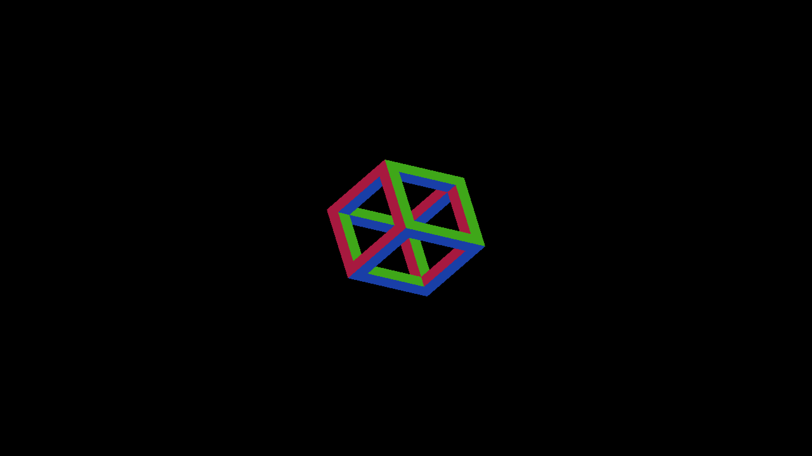
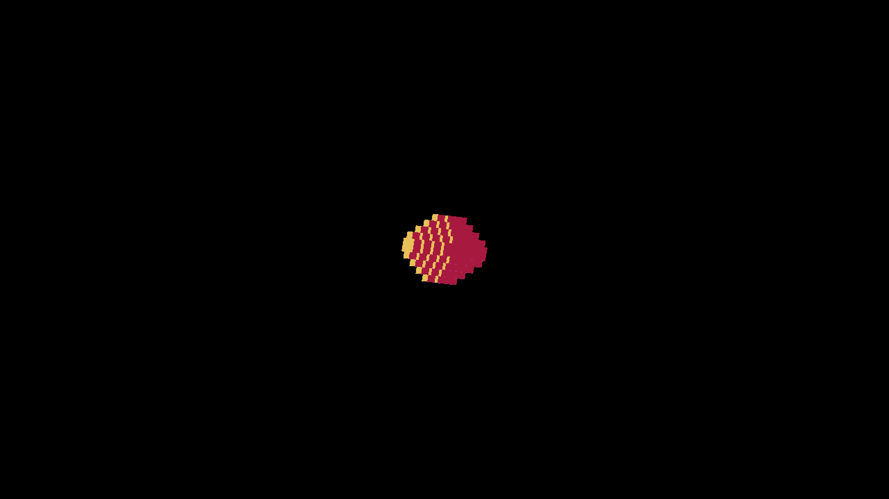
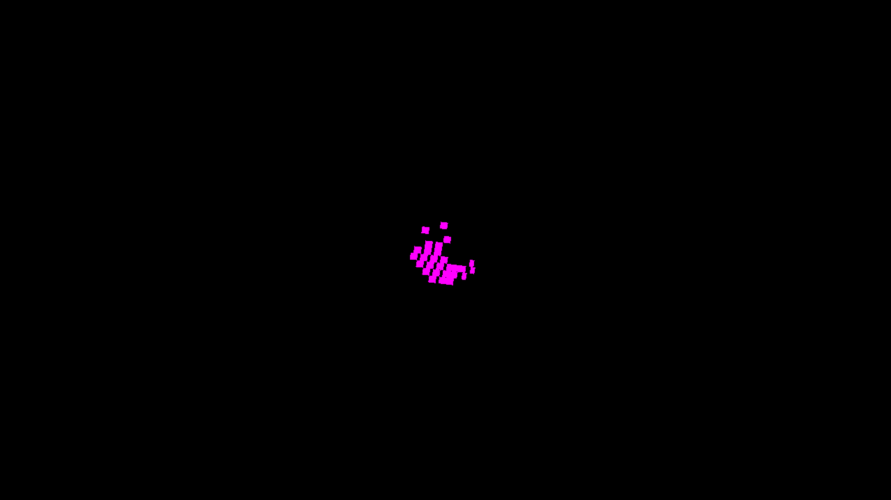
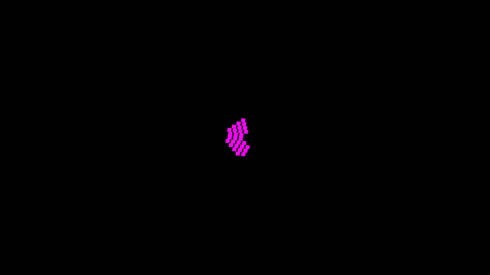

# Multi-voxel source geometry and sun visibility

Base: `07b2dbea0`. Native Metal, Apple M4 Max. This slice adds an independent
oracle and diagnostic evidence, not a production shadow fix.

`render-source-occlusion-metric.py` enumerates exposed original unit-box faces,
uses affine projected depth to choose the visible face, and traces rays from
face centers through the authored occupancy. Rotations use independent Rodrigues
math. Paired normal and shadow overlays separate geometry from sun visibility.
One screenshot pixel around face boundaries is excluded; shadow bias is zero.
Both lit and shadowed interiors must exist for a shadow pass. A blank shadow
image, inverted visibility, wrong overlay and inconclusive all-lit fixture fail.
Sun vector magnitude cannot affect visibility. Shadow-only checks do not validate
silhouette or background; always pair them with the normal overlay.

## Baseline

Eight geometry/normal captures pass with zero missing, extra or wrong-normal
pixels. These checks establish visible normal ownership; same-normal overlapping
faces cannot be distinguished by a normal color alone. Six of eight self-shadow
captures fail. Numbers are false / missed shadow pixels at unchanged tolerance.

| Shape | Yaw 0 | Yaw 90 | Yaw 180 | Yaw 270 |
|---|---:|---:|---:|---:|
| Frame | 212 / 315 | 0 / 0 | 0 / 75 | 0 / 0 |
| Stepped octahedron | 280 / 139 | 1745 / 2610 | 84 / 0 | 178 / 0 |

Normal frames: 1858–1861 and 1866–1869. Shadow frames: 1862–1865 and
1870–1873. `baseline-metrics.json` retains commands, exits and mismatched faces.
`runs.json.gz` retains baseline and caster-normal experiment logs.





## Controlled experiments

The three patches are mutually exclusive, fixture-only Metal experiments against
the base. None remains in production shaders. Build `IRCanvasStressAssets` after
applying a patch. The demo loads its executable-local shader bundle; `build/shaders`
is a separate directory and its contents do not establish what this demo loads.

- Exact caster normals: three temporary marker values encode the known object's
  three rotated axis planes. Frames 1874–1881 have identical oracle counts to the
  baseline; adding caster normals alone does not resolve these failures. Frames
  1882–1885 repeat the frame control after synchronizing the unused build-root
  shader directory. They do not demonstrate a build dependency defect.
- Exact face-center visibility: replace only the source receiver's map lookup
  with brute-force rays through the known frame or octahedron occupancy. Keep
  production receiver reconstruction, normals and final display. All eight views
  pass with zero false/missed shadow pixels (1886–1893). This supports the receiver
  recovery and identifies map sampling as a remaining source of disagreement.
  The experiment uses a 0.0001 model-unit ray-start offset to avoid floating-point
  self-intersection; the independent metric has no shadow bias. The fixed-pose
  brute-force traversal is diagnostic, not a scalable rendering implementation.



`exact-ray-*-metrics.json` retains all eight passing results. `ray-runs.json.gz`
retains the octahedron's full log and the frame's startup log; the frame terminal
reported CLEAN but its full tail was not retained. All nine runs completed CLEAN.
The baseline has four runs, normal-plane control three, and ray control two.

## Reproduce

```sh
fleet-build --target IRCanvasStress
fleet-run --timeout 45 IRCanvasStress --only orbit --focus-orbit 7 --no-spin --no-auto-rotate --pivot-origin --no-ao --zoom 4 --debug-overlay normals --auto-screenshot 6 --sweep-yaw 0 4.71238898 4
```

Repeat with `--debug-overlay shadow`; use focus 3 for the octahedron. Match each
capture to yaw 0, 90, 180, 270 in order. Example retained-frame check:

```sh
python3 scripts/render-source-occlusion-metric.py docs/pr-screenshots/codex/source-face-occlusion-oracle/capture-1871.png --shape octahedron --yaw 90 --shadow-overlay
```

This baseline command intentionally exits 1. The matching normal capture 1867
without `--shadow-overlay` exits 0, as does exact-ray shadow capture 1891.

Validation: 182 rendering tests and `ruff check scripts/` pass. Focused independent
review caught sun magnitude dependence; normalization and its extreme-magnitude
controls were corrected before publication. No OpenGL runtime,
continuous within-face shadow edges, moving-light or population-cost claim.

## Next implementation constraint

A nearest finite sun-map sample does not preserve the actual footprint at the
receiver ray. Plane normals alone cannot recover discarded boundary geometry or
an occluder hidden behind another primitive at the sampled location. Preserve
finite primitive coverage/ownership through the lookup, with a bounded candidate
representation and measured memory/dispatch cost. Do not widen bias, blur, or
replace legitimate stepped occupancy with the smooth analytical hull. Keep this
oracle and the floor-edge oracle as separate acceptance gates.
