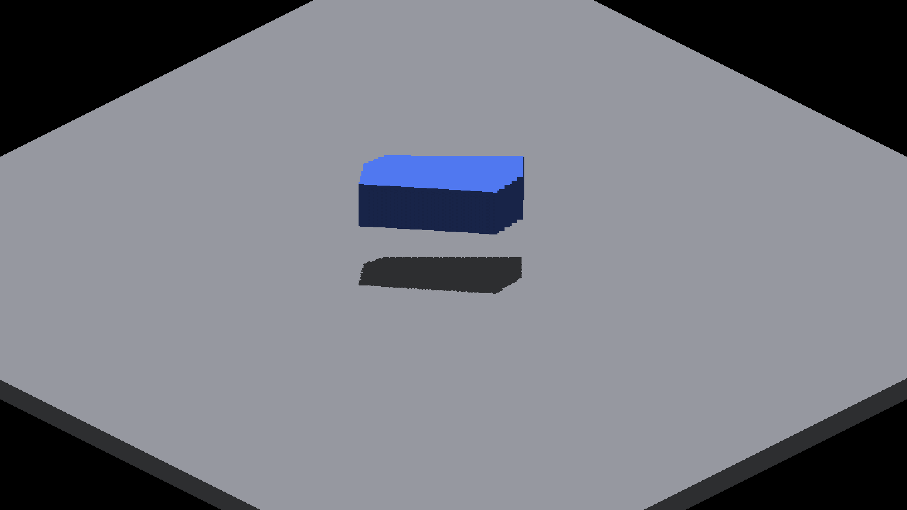

# Shared sun cascade geometry

The bake, feeder-density cap and source-face layout share one cascade policy.
The pure swept-frustum projection lives in IRMath; viewport-to-integer conversion
remains at the prefab boundary and preserves truncation toward zero.

Validation: 15 math/feeder tests, executable CPU/GLSL/Metal layout agreement,
IRCanvasStress and IrredenEngineTest builds, header checks and formatting.
Native Metal captures at camera yaws 0/90/180/270 are RGB-identical, and every
captured tile-table CSV is byte-identical. Manifests and hashes are adjacent.
The probe synchronizes readback; its run timing is not performance evidence.
Native Windows/OpenGL rendering remains unmeasured.

| Before | Shared math |
|---|---|
|  |  |

The image deliberately retains the baseline dense-index shadow teeth. This
mechanical extraction does not change finite-query eligibility or overflow
policy. The [overflow reference](../../../perf/bounded-source-face-reference.md)
isolates that separate visual issue without making its diagnostic the default.
