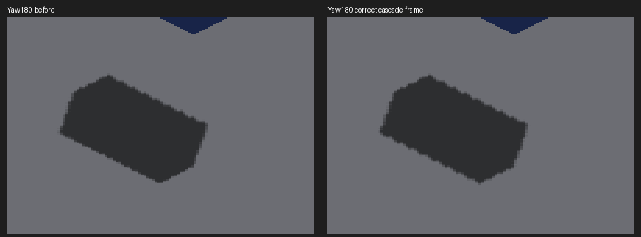

# Shared cascade receiver coordinates

The sun-map bake builds its cascade prisms in the snapped camera frame, then
rotates corners into world space. Receivers must therefore select their cascade
using `dot(worldPosition, inverseCardinalRotation * (1,1,1))`. They previously
passed either raw raster depth (including subdivisions on the main canvas),
per-axis lattice depth without its sub-cell offset, or unrotated world depth.

The CPU packs the cascade depth axis into the unused w channels of the existing
sun direction/U/V vectors. Both shader public receiver functions derive depth
from the unbiased world position; callers no longer provide a depth with an
ambiguous basis or density. Raster normal bias remains confined to shadow lookup.
Uniform layout, allocation, dispatch count, filtering and map resolution are
unchanged. World receiver reconstruction itself is outside this correction.

## Deterministic validation

`test_render_cascade_receiver_space.py` extracts the CPU packing statements, its
actual cardinal-rotation helper, and both GLSL/Metal public receiver wrappers.
Independent tabulated inverse rotations place points at five depths around the
split, in all four quadrants. World-unit inputs recovered at four densities
must preserve the same prism depth. The raster wrapper must apply its positional
bias without moving cascade depth. Mutants using world xyz depth, density-scaled
depth, or biased depth are rejected. This tests the coordinate boundary; it does
not execute GPU surface reconstruction or certify cascade-map completeness.

198 rendering tests, native build, header checks, ruff and diff checks pass.
Focused review found no incompatible w-channel consumer or enabled-path overwrite.
OpenGL runtime remains unverified on this Metal host.

## Native result: not a floor-edge fix

Baseline `da85716b5ec707dfd82ccfee26b0033fd4f2e477`; current captures contain this
PR's production changes. Native Metal, Apple M4 Max, 2560×1440. Both floor sweeps
and the source-frame sweep exited cleanly.

```sh
fleet-run --timeout 45 IRCanvasStress --only shadowbox,floor --probe-grid --pivot-origin --no-spin --no-auto-rotate --no-ao --subdivisions 1 --zoom 2 --auto-screenshot 6 --sweep-yaw 0 4.71238898 4
python3 scripts/render-shadow-box-metric.py --grid --effective-subdivisions 2 --iso-scale 8 4 --strict-edges docs/pr-screenshots/codex/sun-cascade-receiver-space/capture-2007.png docs/pr-screenshots/codex/sun-cascade-receiver-space/capture-2008.png docs/pr-screenshots/codex/sun-cascade-receiver-space/capture-2009.png docs/pr-screenshots/codex/sun-cascade-receiver-space/capture-2010.png
```

Measured effective caster density is 2 despite requested base 1. Strict checks
still fail all four views; their tolerance is unchanged. The 180-degree edge
result worsens, consistent with the corrected depth selecting a different cascade
phase; that cause is inferred from the changed coordinate path, not a cascade-ID
readback.
This is retained explicitly, not treated as visual acceptance. Merge approval
remains pending the visual follow-up. Raw reports: [before](before-metrics.txt),
[after](after-metrics.txt).

| Yaw | Before missing/excess | After missing/excess | RGB pixels changed |
|---|---:|---:|---:|
| 0 |207/141|207/141|0|
| 90 |65/515|65/515|0|
| 180 |12/266|19/356|1488|
| 270 |96/546|96/546|0|

All aggregate shadow-IoU checks still pass, which illustrates why they cannot
replace strict edge checks. At 180 IoU changes .963→.958 and area ratio
1.027→1.030. Other floor captures are RGB-identical.



The comparison crops `(1060,680)-(1500,990)` without rescaling. Full baseline
frames are 2003–2006; current frames 2007–2010, ordered 0/90/180/270.

Current rigid-frame shadow overlays 2011–2014 are RGB-identical to 1967–1970
from the [continuous source receiver evidence](../continuous-source-face-lighting/README.md),
preserving those four passing independent continuous-visibility results.
Their recipe is the same isolated `--only orbit --focus-orbit 7 --no-spin
--no-auto-rotate --pivot-origin --no-ao --zoom 4 --debug-overlay shadow
--auto-screenshot 6 --sweep-yaw 0 4.71238898 4`.

## Next visual work

Correct cascade coordinates remove one inconsistency but do not solve finite
map coverage or the SDF floor's approximate recovered surface and per-trixel
lighting. Preserve exact SDF hit location, normal and winner ownership through
lighting/presentation, then carry projected boundary coverage to fragments.
Do not widen bias, blur shadows, or restore the wrong depth convention to hide
one map phase's errors. Approval of the overall floor-shadow visual work remains
pending the unchanged strict geometry gate. No throughput improvement is claimed.

## Refreshed merge decision

This production correction is withheld from merge-ready work. The refreshed
parent `db657f404d65903425ffa4c1f3518a734df66051` and child production merge
`847a3d75c57309ea94d5b8326803b12363598ba0` both include master through
`3322a4877`. Their native cardinal floor captures 2043–2046 and 2047–2050
are respectively RGB-identical to 2003–2006 and 2007–2010. Both builds and
capture runs succeeded, with CLEAN exits. The 180° regression therefore
survives the SDF fog-carrier merge unchanged (12/266 to 19/356 missing/excess).

Independent review confirmed the coordinate-axis derivation but found no
proof explaining the regressed cascade selection/sampling. The scalar test
stubs the sampler; it does not validate cascade selection or rendered edges.
The diagnostic/test PRs can proceed without this production change. No
tolerance change or presumed root cause is used to approve the regression.

The [forced-cascade controls](selector-control/README.md) reproduce the corrected
fixture with the far map alone, while neither map passes strict edge checks.

The [fragment and GRID-face controls](fragment-control/README.md) isolate a
remaining map-side error with exact receiver geometry. Reusing finite face
queries for the GRID caster matches the exact-ray reference at all four
cardinal views; general receiver storage and query scalability remain pending.
