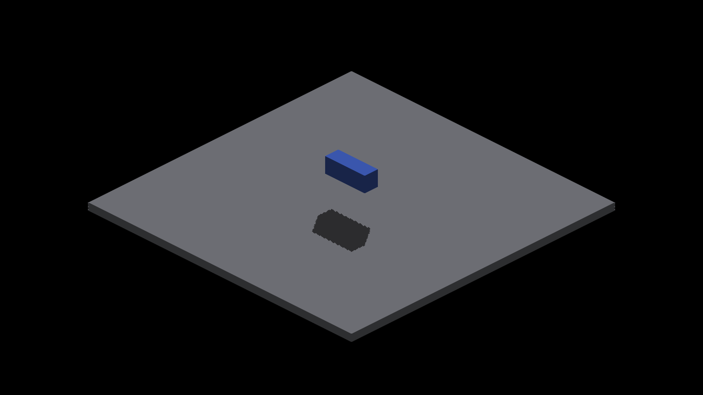

# Fragment receiver and finite GRID face controls

Diagnostic experiments at `fa59287a44d5412b35a3475deb63a98d666feb9d`, native
Metal, 2560×1440 screenshots from a 1280×720 framebuffer. Production shaders
are unchanged by this evidence commit. Apply exactly one retained patch to
the pinned ref, rebuild assets, and run the same recipe for each arm:

```sh
fleet-build --target IRCanvasStressAssets -j 3
fleet-run --timeout 45 IRCanvasStress --only shadowbox,floor --probe-grid --pivot-origin --no-spin --no-auto-rotate --no-ao --subdivisions 1 --zoom 2 --auto-screenshot 6 --sweep-yaw 0 4.71238898 4
```

Each run exited CLEAN, exit 0, four seconds. Shaders were restored and assets
rebuilt after the experiments. These patches are fixture-only Metal controls;
no OpenGL runtime or general receiver implementation is claimed.

## Controlled factors

All arms reconstruct the same known floor at z=2 per framebuffer fragment,
with normal (0,0,-1). The neutral interior is selected by the existing color
segmentation convention and excludes the floor border. The probe's density,
camera origin and floor plane are hardcoded. This deliberately bypasses the
production receiver reconstruction and one-lighting-value-per-trixel storage.
It is not valid for arbitrary receivers, camera placement or render scale.

- [Map](fragment-map.patch): invoke the production surface-shadow sampler at
  each fragment. The existing depth maps and normal cascade selection remain.
- [Near map](fragment-map-near.patch): same, but force the near cascade,
  bypassing its interior guard. This is diagnostic, not a valid general fallback.
- [Exact ray](fragment-ray.patch): replace only the visibility query with the
  known box/slab ray test. This refreshes the older exact-fragment reference on
  the current base; it hardcodes the caster too.
- [GRID face records](fragment-grid-faces.patch): use the map arm's fragment
  receiver and existing surface sampler, but index all emitted GRID faces in
  the geometric face-query records. Their map writes use the source fallback
  layer, so a complete geometric miss is not overridden by a rasterized tap.
  The voxel centers, exposed-face selection and projected quad geometry are
  unchanged. The finite faces come from the actual voxel caster, not the
  hardcoded reference box. This diagnostic also changes other voxel caster
  categories if present; the isolated scene contains only the GRID probe.

## Results

Each sequence is ordered 0/90/180/270 degrees. Use the existing metric with
`--grid --effective-subdivisions 2 --iso-scale 8 4 --strict-edges` and its four
full-frame images. Requested base density 1 yields effective density 2.
Counts are missing/excess pixels outside the unchanged one-pixel boundary band.

| Yaw | Map | Near map | Exact ray | GRID face records |
|---|---:|---:|---:|---:|
| 0 | 9/10 | 9/5 | 0/0 | 0/0 |
| 90 | 6/22 | 7/6 | 0/0 | 0/0 |
| 180 | 46/49 | 4/10 | 0/0 | 0/0 |
| 270 | 17/53 | 1/10 | 0/0 | 0/0 |

| Arm | Captures | Strict exit | Report |
|---|---|---:|---|
| Map | 2059–2062 | 1 | [metrics](map-metrics.txt) |
| Near map | 2063–2066 | 1 | [metrics](near-metrics.txt) |
| Exact ray | 2067–2070 | 0 | [metrics](ray-metrics.txt) |
| GRID face records | 2071–2074 | 0 | [metrics](grid-faces-metrics.txt) |

The GRID-face arm is full-frame RGB-identical to the exact-ray arm at every
angle: [comparison counts](rgb-comparison.txt). The map arms still fail with
exact receiver geometry and fragment evaluation. Thus those residual errors
cannot be attributed solely to integer SDF recovery or per-trixel lighting.
The geometric face-query path removes them in this fixture. This supports
sharing that path across caster modes; it does not prove arbitrary geometry,
capacity overflow, moving light, noncardinal or high-density behavior.

| 180° map sampling | 180° actual GRID face queries |
|---|---|
|  |  |

## Implementation TODO

1. Preserve deterministic SDF winner ownership before publishing position,
   normal and color. Depth equality alone permits multiple writers today.
2. Carry the winning analytical surface or voxel-cell face to its last
   consumer; recover it at the actual fragment coordinate. Do not generalize
   the fixture's hardcoded plane, material test or scale into production.
3. Consolidate finite caster queries without changing authored, revoxelized
   or GRID geometry. Test dense tile/record overflow and mixed fallback layers;
   measure GPU cost and storage before enabling GRID record emission broadly.
   This experiment measures correctness only, not throughput or completeness
   of every queried tile.
4. Gate the general path with unchanged strict edges, moving light and camera,
   all quadrants, fractional/odd densities, overlapping receiver ties and
   both backends. Preserve the intentional cell boundaries of voxelized SDFs.

The production cascade-coordinate correction remains deferred. A passing
fixture-only prototype is not approval of the unchanged production renderer.
