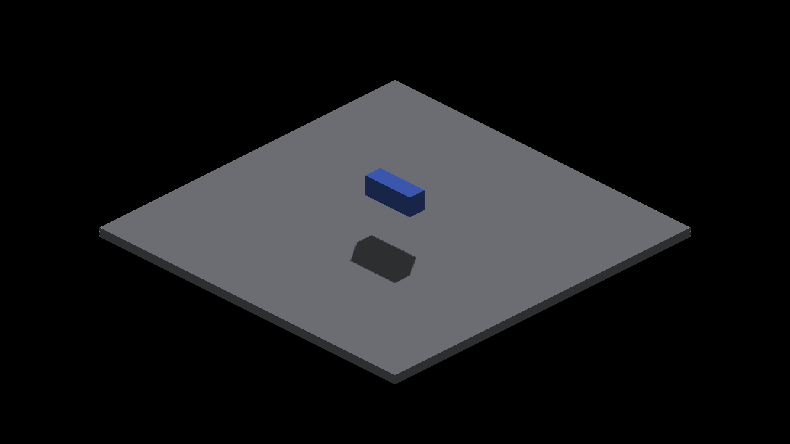

# Cascade selection controls

Diagnostic captures on `486355438343dca920c9972c1a886a04b8d09def`, native
Metal, 2560×1440. Apply exactly one retained patch to that ref, build
`fleet-build --target IRCanvasStress -j 3`, then run:

```sh
fleet-run --timeout 45 IRCanvasStress --only shadowbox,floor --probe-grid --pivot-origin --no-spin --no-auto-rotate --no-ao --subdivisions 1 --zoom 2 --auto-screenshot 6 --sweep-yaw 0 4.71238898 4
```

Both runs exited CLEAN (exit 0, five seconds). Captures 2051–2054 force
near; 2055–2058 force far, each ordered 0/90/180/270 degrees. Both backend
patches change only selection in the two-cascade branch. Forced near
intentionally bypasses the near-interior guard, so this is not a valid
production fallback. No shader edits from these controls are shipped.

The corrected baseline 2047–2050 is RGB-identical to forced far in all
four views. The parent 2043–2046 matches forced far at 0/90/270 degrees.
At 180 degrees the parent differs from both forced maps: 1784 pixels from
near and 1488 from far. This establishes far-map output equivalence for
the corrected fixture, not a per-pixel cascade-ID readback. The parent may
mix or blend maps; these controls do not distinguish those possibilities.
See [full RGB counts](rgb-comparison.txt).

| Yaw | Forced near missing/excess | Forced far missing/excess |
|---|---:|---:|
| 0 | 228/120 | 207/141 |
| 90 | 106/403 | 65/515 |
| 180 | 16/255 | 19/356 |
| 270 | 113/378 | 96/546 |

Both maps fail every unchanged strict edge gate. Run the existing metric
with `--grid --effective-subdivisions 2 --iso-scale 8 4 --strict-edges`
and each four-frame sequence. Base density 1 becomes effective density 2
in this fixture. [Near report](near-metrics.txt), [far report](far-metrics.txt).
Aggregate IoU still passes every view and does not establish edge correctness.

| 180° forced near | 180° forced far |
|---|---|
|  |  |

Selecting one map globally does not solve the geometry acceptance problem.
The next controlled comparison must distinguish SDF receiver reconstruction
from finite caster-map coverage before changing either. The cascade
coordinate PR remains deferred; neither forced selector is a proposed fix.
