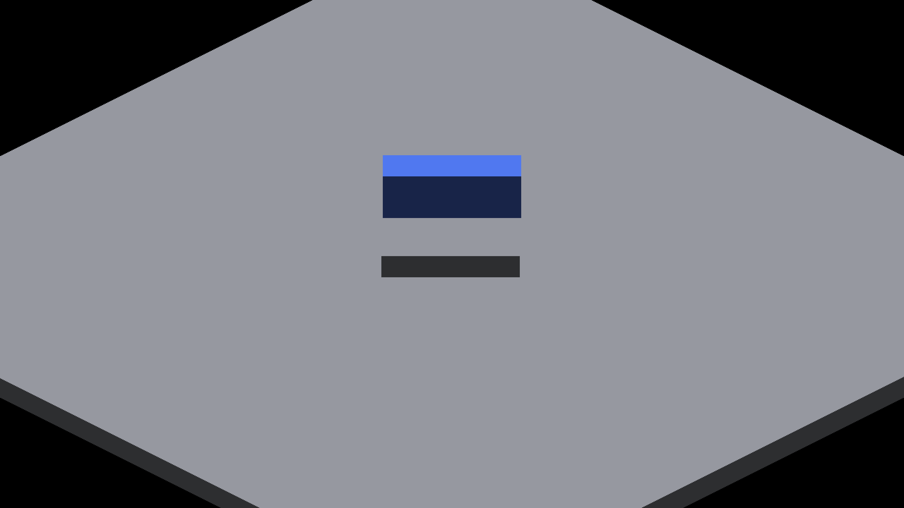
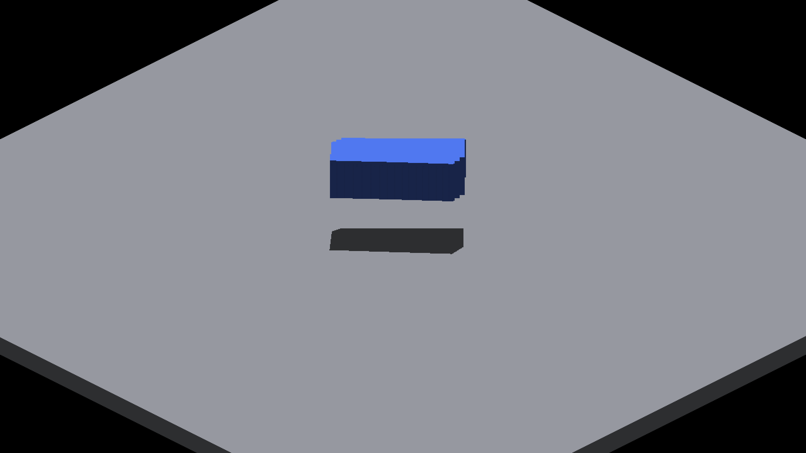
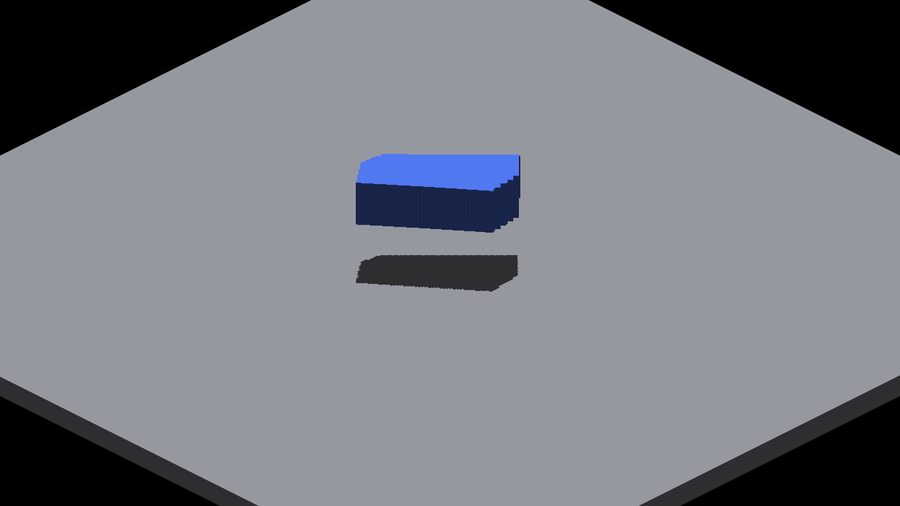
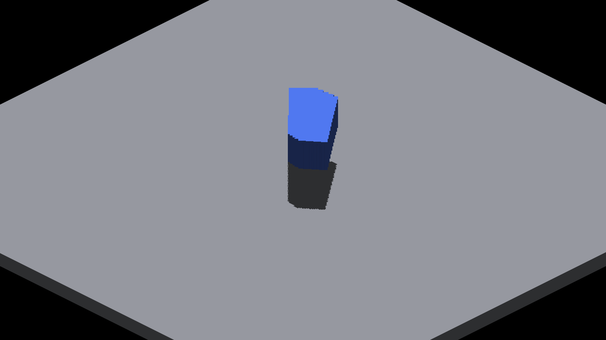
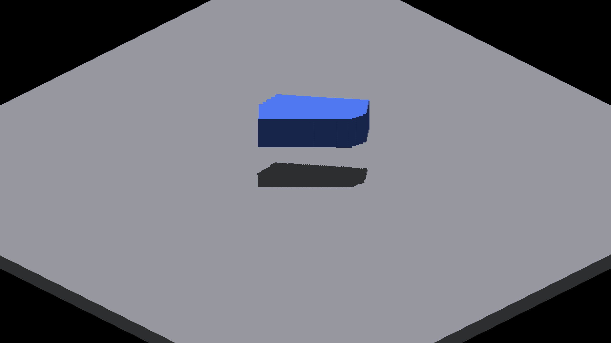

# Source-face index diagnostic captures

See [the probe report](../../../perf/sun-face-index-diagnostics.md) for commands,
raw counters and limitations. Production shaders are unchanged. These are
caster-count comparisons, not before/after rendering fixes.

| Boxes | Maximum tile count | Incomplete tiles, near/far | Capture at camera yaw 90° |
|---|---:|---:|---|
| 1 | 2 | 0 / 0 |  |
| 63 | 64 | 0 / 0 |  |
| 64 | 65 | 132 / 56 |  |
| 128 | 129 | 154 / 71 |  |

The 63/64-box transition introduces fine teeth on otherwise nearly identical
silhouettes. The shared floor also contributes a face record under this sun.
The 128-box capture at each cardinal camera yaw is RGB-identical to the
preceding PR's probe-disabled capture.

| Camera yaw 0° | Camera yaw 180° | Camera yaw 270° |
|---|---|---|
|  |  |  |
