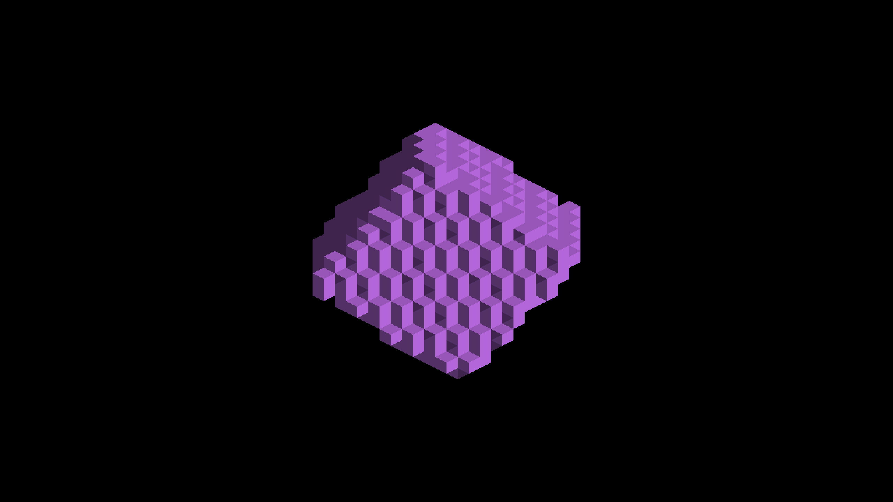
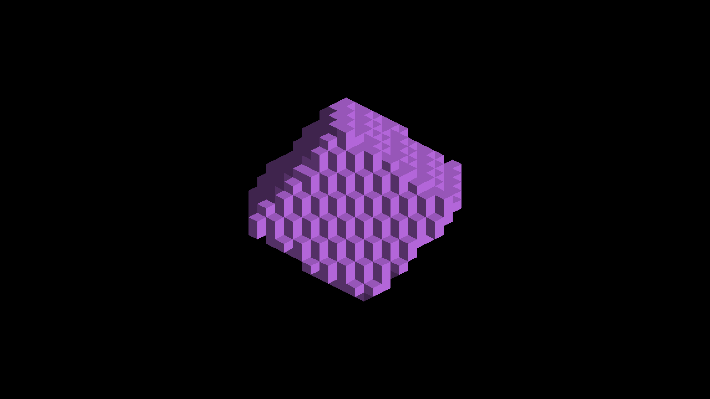

# Caster/receiver plane agreement

Native Metal, Apple M4 Max, 2560×1440. Before is parent `b09cec8d1`;
after is this branch's sampler and face metadata. Every capture run exited CLEAN.
No oracle thresholds were relaxed. These are relative regression results, **not**
a passing whole-sweep gate. Existing false and missed shadows remain.

## Lit evidence

Grounded purple cube at 45°, before and after. False dark bands disappear;
legitimate partial normal faces remain.




The corresponding 135° lit pair is 1475/1493. Shadow-only sweeps are below.

## Strict ray oracle

Counts are false/missed interior framebuffer pixels, with zero terminator
allowance. One full tested trixel interior in this fixture contains 392 pixels.

| Fixture | Yaw (degrees) | Before false/missed | After false/missed | Before/after capture |
|---|---:|---:|---:|---|
| grounded | 0 | 2352/0 | 2352/0 | 1458/1476 |
| grounded | 45 | 10192/392 | 0/392 | 1459/1477 |
| grounded | 90 | 784/0 | 784/0 | 1460/1478 |
| grounded | 135 | 392/392 | 0/392 | 1461/1479 |
| grounded | 180 | 392/392 | 392/392 | 1462/1480 |
| grounded | 225 | 784/0 | 784/0 | 1463/1481 |
| grounded | 270 | 392/13328 | 392/13328 | 1464/1482 |
| grounded | 315 | 1568/4704 | 1568/4704 | 1465/1483 |
| cube | 0 | 3136/0 | 3136/0 | 1466/1484 |
| cube | 45 | 7448/0 | 0/0 | 1467/1485 |
| cube | 90 | 4704/0 | 4704/0 | 1468/1486 |
| cube | 135 | 1568/784 | 0/784 | 1469/1487 |
| cube | 180 | 0/392 | 0/392 | 1470/1488 |
| cube | 225 | 0/0 | 0/0 | 1471/1489 |
| cube | 270 | 784/2744 | 784/2744 | 1472/1490 |
| cube | 315 | 0/3528 | 0/3528 | 1473/1491 |

The cyan cube at 45° passes the full strict gate, including exercised occlusion,
sufficient resolution and no clipping. Other zero-error entries here are not
independently claimed to pass those additional gates. `shadow-metrics.json`
retains the sweep counts and false-shadow clearance measurements.

## Reproduce

For `grounded`, focus index is 2; for `cube`, index is 1. Captures 1458–1465
and 1476–1483 are grounded before/after; 1466–1473 and 1484–1491 are cube.

```sh
fleet-run IRCanvasStress --only revox --focus-revox 2 --no-spin --no-auto-rotate --pivot-origin --zoom 8 --no-ao --debug-overlay shadow --auto-screenshot 10 --sweep-yaw 0 5.497787144 8
python3 scripts/render-revox-face-metric.py docs/pr-screenshots/codex/sun-receiver-footprint/capture-1477.png --fixture grounded --yaw 45 --shadow-overlay --terminator-tolerance 0
python3 scripts/render-revox-face-metric.py docs/pr-screenshots/codex/sun-receiver-footprint/capture-1485.png --fixture cube --yaw 45 --shadow-overlay --terminator-tolerance 0
```

The grounded command intentionally still fails with 392 missed pixels. For the
lit pair, omit `--debug-overlay shadow` and use `--sweep-yaw 0.785398163 2.35619449 2`.

## Regression controls

Four main-grid/floor views at yaw 0/90/180/270 are RGB-identical: before
1429–1432, after 1494–1497. This establishes unchanged output, not correct edges.

```sh
fleet-run IRCanvasStress --only maingrid,floor --no-spin --no-auto-rotate --pivot-origin --no-ao --zoom 4 --auto-screenshot 10 --sweep-yaw 0 4.71238898 4
```

Captures 1498–1500 exercise a world-aligned voxel roof casting onto a detached
staircase at 180/202.5/225°. At 180°, the existing independent blocked/outside
patch oracle passes with zero error in both regions. The unblocked control (1501, adding `--probe-unblocked` and a one-shot sweep at
pi) also passes both patches with zero error using `--staircase --unblocked`.
Oblique captures are visual coverage only, not numerical acceptance.

```sh
fleet-run IRCanvasStress --only shadowocclusion --probe-staircase --pivot-origin --no-spin --no-auto-rotate --no-ao --subdivisions 1 --zoom 4 --auto-screenshot 6 --sweep-yaw 3.14159265 3.92699082 3 --source-face-shadows
python3 scripts/render-sun-occlusion-metric.py docs/pr-screenshots/codex/sun-receiver-footprint/capture-1498.png --staircase
```

## Limits / next checks

The two-plane agreement test can conservatively reject real hits near finite
boundaries. A single nearest depth sample still loses sub-texel coverage. The
remaining quadrant-dependent misses and GRID floor silhouette steps require
finite receiver/caster coverage work, not blur or normal averaging. OpenGL
sources are mirrored and scalar metadata tested, but native GPU validation here
is Metal only. Added fixed ALU has not yet been profiled at population scale.
