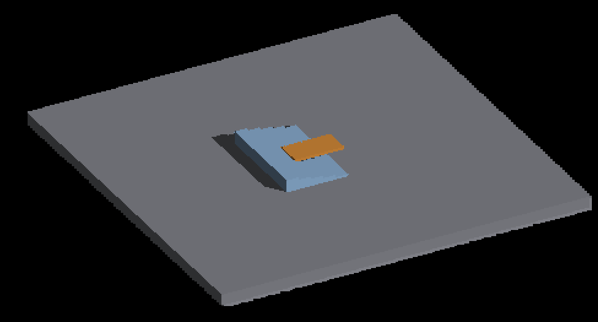
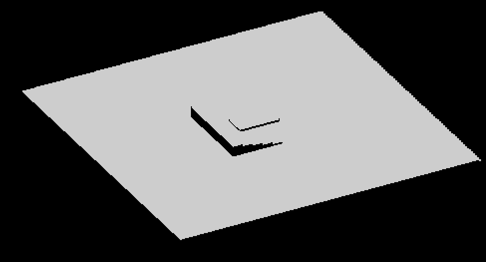

# Shared surface material and sun terms

All ten native before/after pairs are RGB pixel-identical: five ordinary-lighting
views and five sky-only views. This is preservation evidence, not acceptance of
the existing geometry or shadow artifacts in the scene.

Regular/source-face compute lighting, overflow lighting and finite analytical
fragment lighting share `surfaceMaterialColor`. With the palette disabled, it
returns `albedo * AO` without accessing a texture. With the palette enabled, it
returns `albedo * palette(AO, luminance).rgb`, using the existing luminance weights
and nearest, clamped level-zero lookup. Palette alpha does not affect material
RGB, and AO selects the palette coordinate rather than multiplying the result
again. The analytical procedural-material fallback still returns before any
material or lighting resource reads.

The existing continuous source-face path uses `surfaceSunTerms` to retain ambient
and direct-sun RGB separately. It preserves the existing multiplication order:
`ambient = material * sunAmbient * sunIntensity` and
`direct = material * (1-sunAmbient) * Lambert * sunIntensity`. Local light and sky
remain separate additions to the base. Visibility attenuates only the direct
term, and display mapping follows composition.

This refactor adds no GPU allocation, binding, dispatch or draw. It does not
enable continuous receiving for attached beauty lighting or change fog behavior.
It establishes common material preparation for that work while preserving
ordinary shading's arithmetic.

## Capture recipes

The before artifact is the staged Metal Debug build used by parent
`4e6216bb43636881577b3797371c7f829e42bbb5`; the source-only test cleanup after its
build does not affect rendering. Manifests identify the executable and staged
shader hashes. After captures follow a candidate `fleet-build --target
IRCanvasStress`. Full native frames and profile reports are retained here.

```bash
python3 scripts/perf/repeat_profile.py --target IRCanvasStress --output /tmp/material-control --repeats 1 -- --only shadowocclusion,orbit,floor --probe-grid --probe-staircase --no-spin --no-auto-rotate --pivot-origin --zoom 1 --subdivisions 1 --auto-profile --auto-screenshot 6 --sweep-yaw 0 5.10508806 5
```

Repeat with `--probe-sky` to isolate HDR sky with zero sun intensity. The five
views cover yaw 0°, 73.125°, 146.25°, 219.375° and 292.5°. These are short visual
regression captures containing readbacks, not throughput benchmarks. They include
regular and overflow attached geometry, detached/source modes and the analytical
floor. The ordinary sweep records up to 1,552 overflow entries with zero drops.

Native palette-enabled coverage is not established by this demo. Executed shader
tests exercise the palette sampler contract, AO, HDR-valued materials, ambient/
direct decomposition and procedural fallback. Native OpenGL execution remains
for another host.

- `test_render_surface_material.py` executes both helpers and their regular and
  overflow call sites: 864 cases per backend, with texture spies checking palette
  identity, AO/luminance coordinates, explicit LOD zero, sample count and the
  Metal sampler policy. Twenty-two mutations across both backends are rejected.
- `test_render_source_face_lighting.py` adds 144 sun decompositions and 3,456
  executed source-record compositions per backend against double-precision
  expectations. Eighteen new mutations across both backends are rejected, including
  incorrect ambient factors, swapped retained fields, lost HDR/exposure and early clamping.
- `test_render_shape_surface_lighting.py` executes 3,456 cases and nine mutations
  per backend. Procedural fallback performs no albedo/AO/palette/shadow/local reads;
  supported surfaces issue a palette read only when enabled.

These adapters execute production shader expressions on the CPU. They do not
prove GPU texture execution or cross-platform floating-point equivalence; native
Metal captures cover the demonstrated non-palette scenes.

At yaw 73.125°, unscaled crops `(775,475)–(1750,1000)` show the attached staircase
and analytical floor. Full frames retain the surrounding detached shapes.

| Before | After |
|---|---|
|  |  |

| Sky-only before | Sky-only after |
|---|---|
|  |  |

## Attached lighting transport remains a separate decision

Current per-axis lighting overwrites albedo with display-mapped RGBA8. A new
fragment query cannot recover the independent linear lighting terms from that
value. Retaining two `vec4` terms per reserved slot would cost
`32 * (3 * cellRegionStride + overflowCapacity)` bytes in addition to current
storage. With the control scene's 1,048,576 overflow capacity, that part alone
would reserve 32 MiB despite only 1,552 live overflow entries.

Compare bounded retained records with preserving material inputs and computing
lighting during presentation. The latter avoids that dense payload but repeats
material/local-light work across quad vertices. Both need explicit resource
lifetimes, disabled-light/overlay fallbacks, fog ordering, a finite-face margin
policy, and measured GPU cost before promotion. This refactor chooses neither
transport scheme and makes no performance claim.
