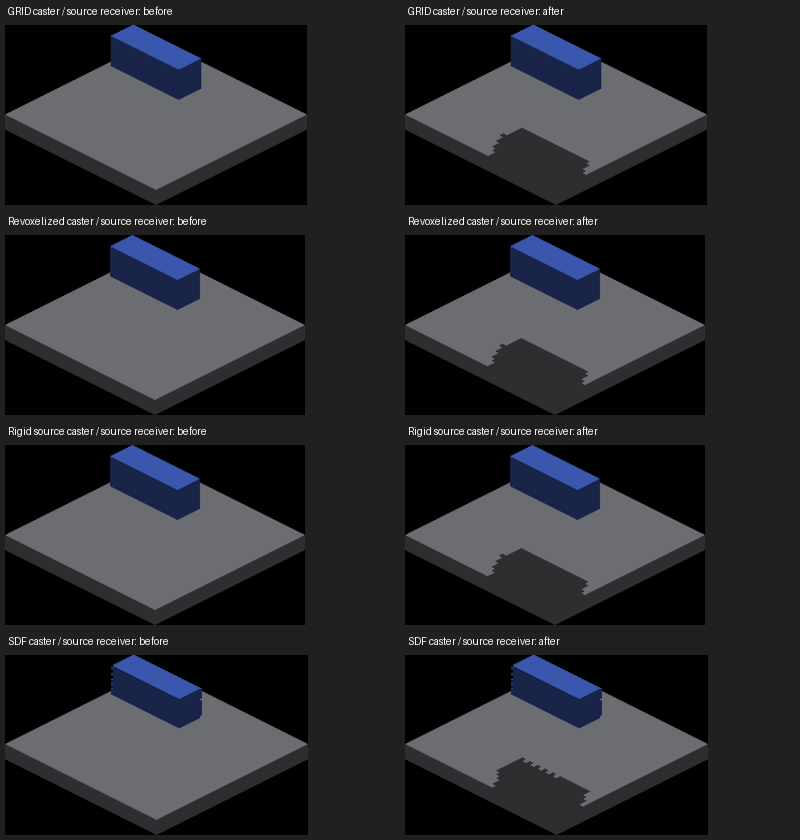

# Source-face shadow reception and floor receiver controls

Base: `01f2caef2` (rigid source casting). Native Metal, Apple M4 Max.

World-placed `SOURCE_FACES` canvases now receive shared world sun shadows at
continuous source-face centers. The center is recovered from the same projected
face geometry as display and AO, before clamping a canvas sample. Camera rotation
is undone once for both position and normal; the owner's world origin is then
added. Density cancels in this recovery. Raw-trixel diagnostics and screen-locked
overlays do not enable this receiver path.

This reuses the existing lighting dispatch and sun map. It adds no GPU buffers,
allocations or dispatches. It also enables the existing world light-volume
sampling branch for these receivers; point/spot lighting has not been separately
validated here. No throughput claim is made.

**Sampling is one value per original voxel face.** Face boundaries remain exact
continuous geometry, but a shadow crossing a face cannot have a continuous edge
under this representation. Continuous surface shadow coverage and explicit
receiver-sampling options remain follow-ups. No blur or inflated coverage is added.

Each row compares the same caster and source receiver at yaw 180 degrees. Parent
frames: matrix 1592/1596/1604 and source-casting 1728; new frames:
1792/1796/1800/1788. Full frames and exact commands accompany the resized sheet.
The compact receiver physically clips the shadow at its outside edge.

## Validation

`runs.json` lists 19 clean native runs, 72 full frames (1786–1857), with compressed
logs. The four caster modes project onto source receivers at all four cardinal
views; source/source also has four diagonal views. These matrix captures establish
participation and visual coverage, not exact shadow-boundary correctness.

- `receiver-oracles.json`: eight full-frame relative receiver-position checks
  (identity and 0.47-radian diagonal rotation at four camera yaws) and four rotated
  normal checks pass with zero counted silhouette or face-value errors.
  The independent Rodrigues oracle checks world-oriented offsets relative to
  the canvas origin; it does not validate translated origin recovery by itself.
- `regressions.json`: unblocked source floor at eight yaws and an isolated oblique
  source box at four yaws match shadows-disabled captures exactly. Existing
  source/SDF, screen-locked and revoxelized controls also match parent frames:
  24 RGB comparisons, zero changed pixels.
- Default-scene context at yaw 0/45 is retained (1854/1855), with a separate
  parent-renderer control (1856/1857). Changes are limited to source objects:
  836/2,792 pixels. These complex self-shadows are visual evidence, not an
  occlusion-oracle pass. Other visible trixel/banding artifacts persist in both
  versions and are not fixed by adding reception.
- Rendering tests: 175 pass, including literal face-center colors at four
  camera yaws and a wrong-face-color negative control. Build/header checks and
  lint results are recorded in the PR.
- OpenGL runtime, moving lights, translated/rotated receiver contact, local-light
  transport and population performance remain unverified.

An initial launch hung before rendering in macOS GLFW window creation and was
terminated (SIGTERM). A queued retry produced frames 1782–1785 but reported
ALIVE-TIMEOUT; those are not acceptance evidence. The clean repeated run starts
at 1786. The failure was sampled before termination and did not reach the renderer.

## Floor-boundary diagnosis (experiment only)

`known-floor-map-control.patch` is a Metal-only fixture experiment against the
base revision. It substitutes the known z=2 floor point/normal and calls the
existing surface-aware sun-map lookup; the caster map remains unchanged.
Apply it separately, build IRCanvasStress and use the command in
`known-floor-run.json`. The retained tail includes four captures and CLEAN exit;
startup output was truncated. Frames 1778–1781 and `known-floor-metrics.txt`
retain the result. The patch is restored out of production code.

| Yaw | Production missing/excess | Known floor + existing map |
|---|---:|---:|
| 0 | 207 / 145 | 18 / 28 |
| 90 | 65 / 518 | 22 / 43 |
| 180 | 12 / 266 | 36 / 85 |
| 270 | 96 / 546 | 29 / 44 |

All four strict checks still fail, at unchanged tolerance. Total errors decrease
in every view, although missing pixels increase at yaw 180. This experiment
changes receiver recovery and selects the surface-aware lookup together; it does
not isolate either change individually. It establishes their combined importance,
not a production SDF fix. Earlier exact-ray controls distinguish the remaining
map/presentation loss. Next work needs reliable SDF surface metadata and geometric
shadow coverage through final presentation, preserving legitimate partial faces.
