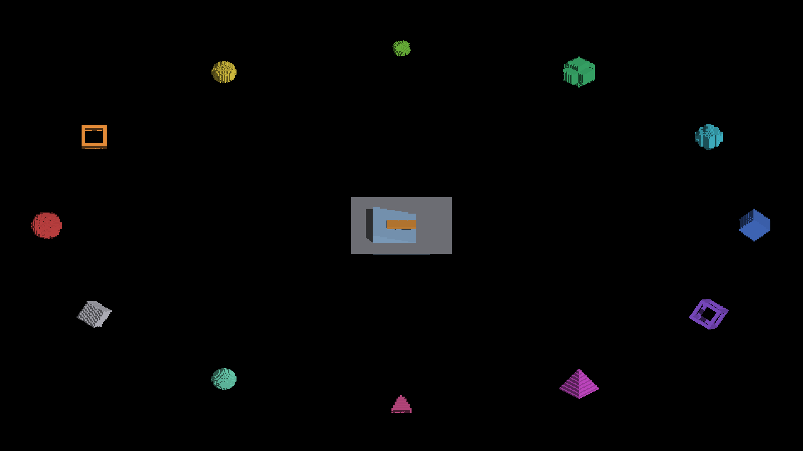

# Visibility prepass subdivision and lifecycle controls

**All 43 matched RGB comparisons pass:** 27 subdivision views, seven lifecycle
views and nine static-profile capture pairs. All 86 full off/on PNGs are retained.
This establishes no prepass image regression in these controls, **not full-scene
visual correctness**. Orbit objects retain substantial baseline banding and teeth
in both arms. Attached lighting and the prepass remain default-off.

The engine runtime is unchanged from the
[parent shared-program prepass](../peraxis-visible-lighting-probe/final/README.md).
This slice retains additional native control runs and adds automatic
allowlisted environment provenance.
Host: Metal Debug, Apple M4 Max, macOS 26.5.2, battery power, 2560×1440 output.
No native OpenGL or dense-population validation is claimed.

## Subdivision sweeps

Base settings 2, 4 and 8 each sweep nine yaws, 0° through 360° in 45° steps,
at zoom 1. [comparison.json](comparison.json) records exact decoded RGB equality
for all 27 pairs, with no tolerance, masks, alignment or resampling.

| Requested base | Logged canvas effective values | Per-axis cap message | Matching views |
|---|---|---|---:|
| 2 | 2 and 1 | No reduction logged | 9 / 9 |
| 4 | 4 and 1 | 4 → 2 | 9 / 9 |
| 8 | 8 and 1 | 8 → 2 | 9 / 9 |

Base is the requested setting; effective is the value a canvas raster uses
after render-mode, zoom and canvas caps. FULL mode (`2`) and zoom scale `1`
are logged. Each effective value above appears 565 times per run because the
log covers multiple canvases; all-frame zoom stays 1 and yaw travel is 360°.

Attached per-axis faces remain at base resolution in world units.
`ir_per_axis_lighting.glsl::perAxisCellToWorld3D` and its Metal twin reconstruct
origins without subdivision scaling. The separately capped dispatch state comes
from `system_voxel_to_trixel.hpp::dispatchPerAxisCanvases` and
`PerAxisCanvas::subdivisionDensity()`. Requesting base 8 therefore does not
establish eightfold refinement of attached faces. These are mixed-renderer
routing controls, not a uniformly refined geometry or population-scaling test.

Every sweep witnesses per-axis overflow `maxEntries=1617`, `maxDropped=0`,
`cap=1048576`, sampled on 248 frames. The separate upstream voxel-span warning
still reports 12 of 1,740 covered cells dropped (`span=1728`, `surface=610`).
Zero per-axis drops does not imply complete upstream occupancy.

## Cardinal lifecycle

Base 1, zoom 4 controls cross just below, at and above π/2. The short case
parks and reuses resources; the longer shot interval exercises release and
allocation. All seven image pairs match. Exact CPU rows are retained in
[lifecycle-comparison.json](lifecycle-comparison.json).

| Control, both arms | Allocate | Park | Unpark | Release | Matching views |
|---|---:|---:|---|---|---:|
| Short crossing | 1 | 1 | 1 | No row | 3 / 3 |
| Longer crossing | 2 | 1 | No row | 1 | 4 / 4 |

“No row” means that scope is absent from the report. These are lifecycle
witnesses; neither their timings nor the moving-sweep timings support a
performance claim.

## Fixed-pose profiles

Three off runs followed by three on runs per base: 18 runs, 363 frames each,
zoom 1, yaw 73.125°, zero yaw travel, all-frame zoom range 1, stats unset.
Every run witnesses 1,533 peak per-axis overflow entries and zero drops over
363 sampled frames. All 18 logged screenshots are retained; their nine pairs
match exactly in [perf-comparison.json](perf-comparison.json).
[performance.json](performance.json) collects the rounded summaries below;
[perf/](perf/) retains every report and summary.

| Base subdivisions | Measurement | Off mean (range), ms | On mean (range), ms |
|---|---|---:|---:|
| 2 | GPU frame envelope | 9.873 (9.859–9.890) | 8.622 (8.563–8.685) |
| 2 | Per-axis scatter scope | 5.254 (5.238–5.262) | 4.024 (4.011–4.045) |
| 2 | Steady frame average | 13.663 (13.640–13.710) | 12.390 (12.300–12.490) |
| 4 | GPU frame envelope | 10.059 (10.027–10.089) | 8.772 (8.735–8.816) |
| 4 | Per-axis scatter scope | 5.493 (5.458–5.512) | 4.188 (4.154–4.205) |
| 4 | Steady frame average | 13.890 (13.880–13.910) | 12.663 (12.640–12.700) |
| 8 | GPU frame envelope | 10.474 (10.416–10.572) | 8.880 (8.613–9.213) |
| 8 | Per-axis scatter scope | 5.916 (5.894–5.941) | 4.357 (4.307–4.403) |
| 8 | Steady frame average | 14.467 (14.360–14.650) | 12.627 (12.320–13.180) |

Causal confidence is limited: sequential arms ran on a shared host while
battery fell from 14% to 10% and load declined from 13.62 to 7.23, potentially
favoring later enabled runs. There was no interleaved or low-battery control.
These measured reductions do not establish a robust adoption speedup. Enabled
scatter includes prepass and replay; Metal scopes overlap, so do not sum them
or interpret the frame envelope as GPU busy time. Density caps and unchanged
attached-face resolution also limit scaling conclusions.

## Provenance

[Runtime comparison](runtime-comparison.json) verifies identical binary, staged
shader and runtime-script hashes across all 16 configurations. Manifests retain
source base `f7a5bebce92f64d91bbf9c97d283901a358badeb`, dirty status, exact commands,
host state and runner-recorded `render_environment`, plus screenshot membership
and original manifest/log hashes. `clean` describes runtime validation, not Git.

All arms set `IR_PERAXIS_SURFACE_LIGHTING=1`; only enabled arms set
`IR_PERAXIS_VISIBILITY_PREPASS=1`. Stats and the recorded overflow switches are
unset. The runner records only seven explicit names as raw strings or `null`,
not arbitrary environment variables. Its 51 tests exercise actual manifest and
child-launch wiring, raw values and secret exclusion; Ruff and diff checks pass.

The [sweep](density-sweeps-command.txt), [lifecycle](transitions-command.txt) and
[static-profile](static-profile-command.txt) launch controllers are retained.
Compact logs preserve capture membership, subdivision/cap messages, warnings
and profile witnesses; JSON records first/last occurrences and repetition
counts. Full reports remain available. [artifacts.json](artifacts.json) inventories
files by SHA-256. Baseline banding/teeth, incomplete-index accuracy and dense
rendering remain open; these controls do not justify default adoption.
