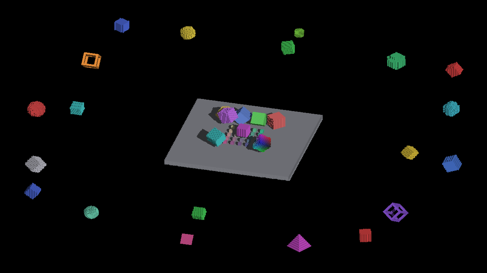

# Workgroup occupancy: unchanged images

This changes GPU work assignment, not geometry or filtering. All RGB pixels in
the three PerfGrid captures match the committed complete-coverage references;
[comparison hashes](comparison.json) and [capture commands](manifest.json)
record the check. The capture-time tracked patch and two added shader helpers
are retained beside the manifest.

| View | Before | After |
|---|---|---|
| Cardinal | [reference](../cardinal-canvas-coverage/cardinal-corrected.png) | [capture](cardinal-after.png) |
| 45° | [reference](../cardinal-canvas-coverage/diagonal-corrected.png) | [capture](diagonal-after.png) |
| 90° | [reference](../cardinal-canvas-coverage/cardinal90-corrected.png) | [capture](cardinal90-after.png) |

These dense wave images retain the reference's visible bands. Equality certifies
preservation, not that every inherited pattern is geometrically correct.

CanvasStress also passes all 24 render checks without reference/threshold changes:
14 RGB comparisons are exact; the other 10 checks cover floor/self-shadow,
world-placed casting, overflow shadow palette and independent orbit geometry.
A separate default pass retains six new RGB-identical screenshots here;
[comparison and command](canvas-comparison.json), [native log](canvas-run.log).

[Revoxelized solids](revoxelize_solids-after.png) ·
[Off-snap wide](so3_offsnap_wide-after.png) ·
[Dense cardinal PerfGrid](cardinal-after.png)

The full harness's intermediate captures were overwritten by its later passes;
its 24-check result is recorded in the [performance report](../../../perf/voxel-workgroup-occupancy/README.md).
This is native Metal evidence. OpenGL execution, feeder-heavy stress timing and
quiet-host Release/million-entity controls remain pending.
